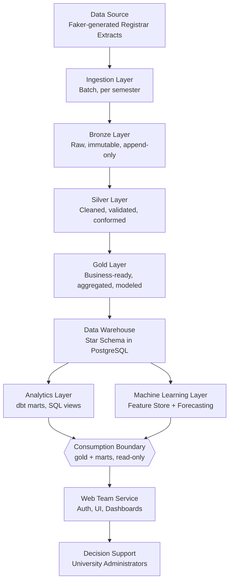
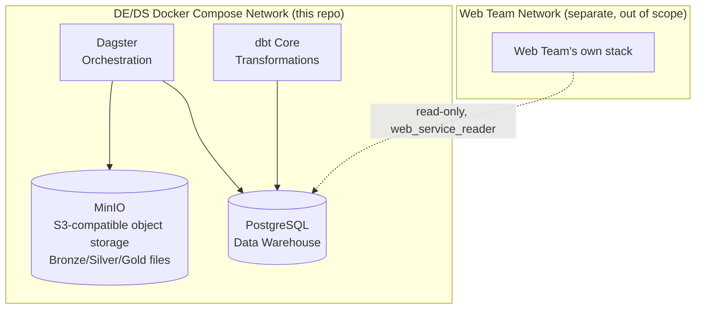

# 02 — System Architecture

## 1. End-to-End Data Lifecycle

Every arrow above is a **contract**, not just a data flow. Each layer only trusts data that has passed through the validation/transformation of the layer before it. The **Consumption Boundary** is the most important contract of all: this repo (Data Engineering + Data Science) owns and is graded on everything to its left; the **Web Team** owns everything to its right and consumes `gold`/`marts` read-only, never writing back and never re-deriving business logic (see `15_Tooling_Responsibility_Matrix.md`).

## 2. Why a Layered Architecture at All

A junior approach: one script that reads Faker output and writes straight to a "clean" table. This fails in practice because:

- You can't reprocess history if business logic changes (e.g., the definition of "dropout" changes) — the raw signal is gone.
- You can't tell "the source was wrong" from "our transformation was wrong" — everything is entangled in one step.
- You can't test each concern in isolation (parsing vs. cleaning vs. business rules vs. aggregation).

The medallion architecture (Bronze/Silver/Gold) exists specifically to separate these concerns and preserve raw history as an immutable audit trail. This is the same reasoning Databricks, Netflix, and most modern data platforms use it for — it's not decoration, it's a response to real operational failure modes.

## 3. Stage-by-Stage Explanation

### 3.1 Data Source
Synthetic registrar-style extracts generated by a Faker pipeline (see `08_Faker_Data_Generator.md`), simulating what a real Student Information System (SIS) export would look like: student records, enrollment records, program/college reference data, per semester, across academic years **2021-2022, 2022-2023, and 2023-2024** (6 semesters total).

### 3.2 Ingestion (Batch)
Runs once per semester (in production) or once per simulated semester (in the capstone). Responsibilities:
- Pick up new source files (CSV/Parquet) from a defined "landing zone."
- Validate file-level expectations (file exists, non-empty, expected columns present).
- Stamp ingestion metadata: `_ingested_at`, `_source_file`, `_batch_id`.
- Land data into Bronze **without transformation** — ingestion should never contain business logic.

**Why batch, not streaming:** the source system produces data at semester cadence. Streaming infrastructure (Kafka, etc.) would add operational complexity with zero benefit, because there is no continuous event stream to process — a classic case of matching the architecture to the actual arrival pattern of data rather than defaulting to the "impressive" option.

### 3.3 Bronze Layer
Raw, append-only, schema-on-read where possible. Full detail in `05_Medallion_Architecture.md`. Purpose: preserve exactly what was received, forever, so any downstream bug can be root-caused against ground truth.

### 3.4 Silver Layer
Cleaned, validated, deduplicated, conformed to standard types and business vocabulary (e.g., program name spelling standardized, status codes mapped to a controlled vocabulary). This is where **data quality rules** live — not business *metrics*, but data *correctness*.

### 3.5 Gold Layer
Business-ready. Star-schema-shaped fact and dimension tables, pre-aggregated KPIs, ML-ready feature tables. This is the **only** layer that downstream consumers (the Web Team, ML) are allowed to query directly, and only via the `gold`/`marts` schemas.

### 3.6 Data Warehouse
Gold tables materialized into PostgreSQL as the queryable warehouse, exposed through dbt-managed marts (documented, tested, versioned SQL).

### 3.7 Analytics Layer
dbt models building semantic marts on top of the warehouse (e.g., `mart_college_performance`, `mart_success_rate_trend`) — this is where SQL-level business logic is documented and testable, instead of buried in a downstream consumer's queries.

### 3.8 Machine Learning Layer
Reads Gold time-series features, trains a forecasting model (see `10_Forecasting.md`), writes predictions back into `fact_forecast` in the warehouse — so forecasts are queried exactly like any other fact, by anyone with `gold`/`marts` read access.

### 3.9 Consumption Boundary
The formal handoff point between this repo and the Web Team. Enforced two ways: (1) a database-level read-only role (`web_service_reader`) with `SELECT` on `gold`/`marts` only — no access to `silver`/`bronze`, no write access anywhere; (2) a documented contract (`11_Data_Consumption_Contract.md`) specifying exactly which tables/columns are stable and versioned for external consumption. This is a deliberate architecture rule, not an accident: it prevents "the dashboard says something different from the warehouse" bugs by making it structurally impossible for a consumer to compute its own version of a metric that already exists in Gold.

### 3.10 Web Team Service (Out of Scope for This Repo)
Owns authentication, UI, and dashboards. Builds and operates its own presentation stack (whatever that is — not specified or built here). Reads only from `gold`/`marts` via `web_service_reader`.

### 3.11 Decision Support
The actual end consumer: university administrators using whatever the Web Team builds to make retention and resourcing decisions.

## 4. Orchestration View

Each job is idempotent and independently re-runnable — a design requirement, not a nicety, because in a real registrar environment corrected data arrives after the fact and the whole point of layered batch processing is being able to safely reprocess. `publish_marts_contract` replaces what an earlier draft called "refresh dashboard cache" — this repo publishes data, it does not refresh anyone else's cache.

## 5. Physical Deployment View (Local/Free Capstone Environment)

Everything in the DE/DS network runs on a single machine via Docker Compose — no cloud spend, fully reproducible with `docker compose up`. The Web Team's stack is deliberately drawn as a separate, external box: this repo does not provision, configure, or contain it.

## 6. Key Architectural Principles Applied Throughout

1. **Separation of concerns** — ingestion ≠ cleaning ≠ business logic ≠ presentation ≠ consuming team.
2. **Immutability of raw data** — Bronze is never edited or overwritten, only appended to.
3. **Idempotency** — re-running any job with the same input produces the same output, never duplicates.
4. **Single source of truth** — `gold`/`marts` is the only layer any consumer, internal or external, is allowed to read from.
5. **Config over code** — colleges, programs, academic years, and business rules are data/config, not hardcoded logic.
6. **Everything free and containerized** — reproducibility for grading, portfolio use, and future extension.
7. **Explicit service boundaries** — a documented, access-controlled contract (§3.9 above), not an informal understanding, is what separates this service from the Web Team's.

---
*Next: `03_Data_Engineering.md` — repository structure, coding standards, and operational practices.*