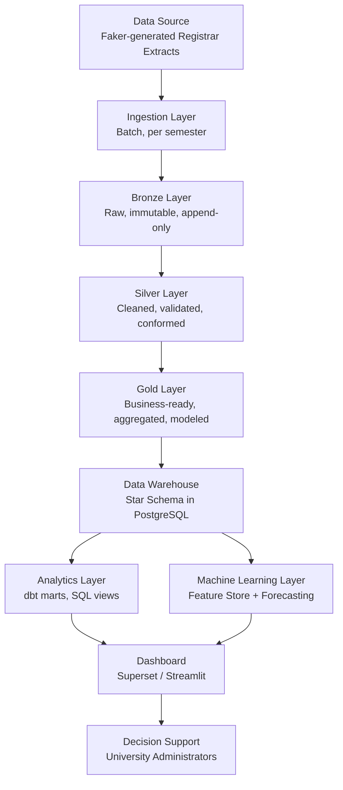
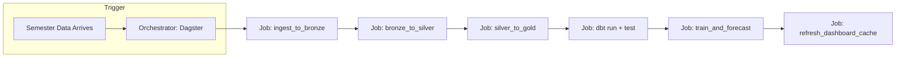
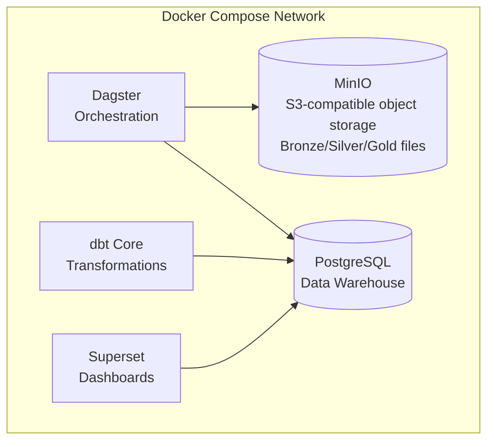

# 02 — System Architecture

## 1. End-to-End Data Lifecycle

Every arrow above is a **contract**, not just a data flow. Each layer only trusts data that has passed through the validation/transformation of the layer before it. This is what makes the pipeline debuggable: if a number in the dashboard looks wrong, you walk backwards one layer at a time until you find where reality and data diverge.

## 2. Why a Layered Architecture at All

A junior approach: one script that reads Faker output and writes straight to a "clean" table. This fails in practice because:

- You can't reprocess history if business logic changes (e.g., the definition of "dropout" changes) — the raw signal is gone.
- You can't tell "the source was wrong" from "our transformation was wrong" — everything is entangled in one step.
- You can't test each concern in isolation (parsing vs. cleaning vs. business rules vs. aggregation).

The medallion architecture (Bronze/Silver/Gold) exists specifically to separate these concerns and preserve raw history as an immutable audit trail. This is the same reasoning Databricks, Netflix, and most modern data platforms use it for — it's not decoration, it's a response to real operational failure modes.

## 3. Stage-by-Stage Explanation

### 3.1 Data Source
Synthetic registrar-style extracts generated by a Faker pipeline (see `08_Faker_Data_Generator.md`), simulating what a real Student Information System (SIS) export would look like: student records, enrollment records, program/college reference data, per semester, 2021–2024.

### 3.2 Ingestion (Batch)
Runs once per semester (in production) or once per simulated semester (in the capstone). Responsibilities:
- Pick up new source files (CSV/Parquet) from a defined "landing zone."
- Validate file-level expectations (file exists, non-empty, expected columns present).
- Stamp ingestion metadata: `_ingested_at`, `_source_file`, `_batch_id`.
- Land data into Bronze **without transformation** — ingestion should never contain business logic.

**Why batch, not streaming:** the source system produces data at semester cadence. Streaming infrastructure (Kafka, etc.) would add operational complexity with zero benefit, because there is no continuous event stream to process — a classic case of matching the architecture to the actual arrival pattern of data rather than defaulting to the "impressive" option.

### 3.3 Bronze Layer
Raw, append-only, schema-on-read where possible. Full detail in `05_Medallion_Architecture.md`. Purpose: preserve exactly what was received, forever, so any downstream bug can be root-caused against ground truth.

### 3.4 Silver Layer
Cleaned, validated, deduplicated, conformed to standard types and business vocabulary (e.g., program name spelling standardized, status codes mapped to a controlled vocabulary). This is where **data quality rules** live — not business *metrics*, but data *correctness*.

### 3.5 Gold Layer
Business-ready. Star-schema-shaped fact and dimension tables, pre-aggregated KPIs, ML-ready feature tables. This is the **only** layer that downstream consumers (dashboard, ML) are allowed to query directly.

### 3.6 Data Warehouse
Gold tables materialized into PostgreSQL as the queryable warehouse, exposed through dbt-managed marts (documented, tested, versioned SQL).

### 3.7 Analytics Layer
dbt models building semantic marts on top of the warehouse (e.g., `mart_college_performance`, `mart_success_rate_trend`) — this is where SQL-level business logic is documented and testable, instead of buried in dashboard queries.

### 3.8 Machine Learning Layer
Reads Gold time-series features, trains a forecasting model (see `10_Forecasting.md`), writes predictions back into `fact_forecast` in the warehouse — so forecasts are queried and visualized exactly like any other fact.

### 3.9 Dashboard
Read-only presentation layer. No transformation logic lives here — dashboards should be "dumb" in the sense that all business logic already happened upstream in Silver/Gold/dbt. This is a deliberate architecture rule, not an accident: it prevents "the dashboard says something different from the warehouse" bugs.

### 3.10 Decision Support
The actual consumer: university administrators using the Executive/KPI dashboard to make retention and resourcing decisions.

## 4. Orchestration View

Each job is idempotent and independently re-runnable — a design requirement, not a nicety, because in a real registrar environment corrected data arrives after the fact and the whole point of layered batch processing is being able to safely reprocess.

## 5. Physical Deployment View (Local/Free Capstone Environment)

Everything runs on a single machine via Docker Compose — no cloud spend, fully reproducible with `docker compose up`, and structurally identical to how a real (larger) deployment would look, just at a smaller scale. This "small but structurally correct" principle is the core design philosophy of the whole project.

## 6. Key Architectural Principles Applied Throughout

1. **Separation of concerns** — ingestion ≠ cleaning ≠ business logic ≠ presentation.
2. **Immutability of raw data** — Bronze is never edited or overwritten, only appended to.
3. **Idempotency** — re-running any job with the same input produces the same output, never duplicates.
4. **Single source of truth** — Gold/Warehouse is the only layer dashboards and ML are allowed to read from.
5. **Config over code** — colleges, programs, and business rules are data/config, not hardcoded logic (enables adding a new college without changing pipeline code).
6. **Everything free and containerized** — reproducibility for grading, portfolio use, and future extension.

---
*Next: `03_Data_Engineering.md` — repository structure, coding standards, and operational practices.*
