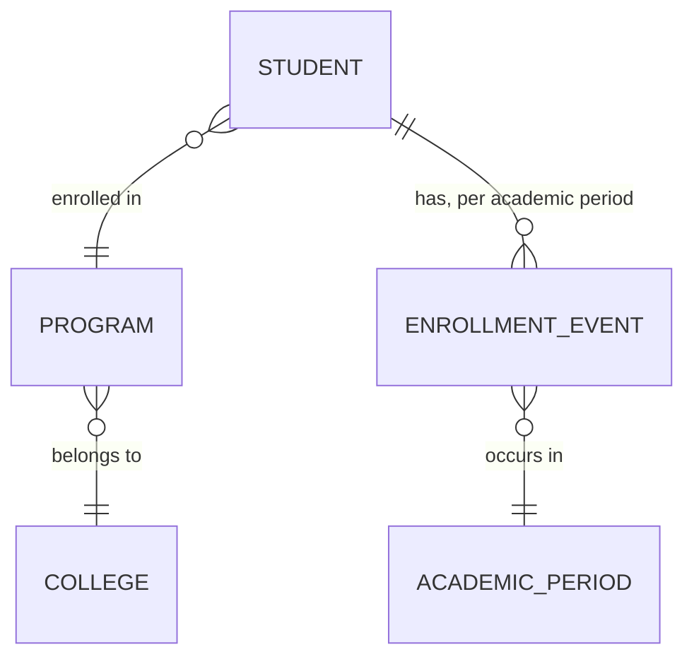
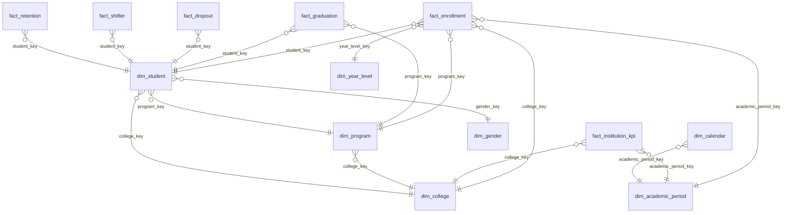

# 04 — Data Modeling

## 1. Conceptual Model

At the conceptual level, the domain is simple: **Students** are enrolled in a **Program** (belonging to a **College**) during an **Academic Period** (one semester of one academic year). Each period, a student has an **outcome**: continues, graduates, drops out, or shifts programs. These outcomes, aggregated over time, produce **institutional KPIs**.

**Academic period grain (authoritative — see `01_Project_Overview.md` §4):** 3 academic years (`2021-2022`, `2022-2023`, `2023-2024`), each with a 1st and 2nd Semester → **6 academic periods** in scope. `academic_year` is a school-year label, not a single calendar year — this is a deliberate correction from an earlier draft that modeled 4 single-year labels (8 semester-periods); see the migration note in `01_Project_Overview.md`.

**Year-level domain (explicit, not freshman-only):** `Freshman, Sophomore, Junior, Senior, Fifth Year, Sixth Year`, with `Super Senior` as a computed flag (not a static label — see `dim_year_level` below) and `Graduate` as the terminal state. Every fact and aggregate in this document is designed to be sliceable by `year_level`, not just by entering cohort — otherwise the warehouse can answer "how many freshmen enrolled" but not "how many seniors were enrolled in College X during 2022-2023, 2nd Semester," which is exactly the kind of question this platform exists to answer.

## 2. Why Dimensional Modeling (Star Schema) Over a Normalized OLTP Model

The source-of-truth registrar system (real or simulated) is OLTP-shaped — normalized, optimized for transactional writes. The warehouse's job is the opposite: fast, intuitive **analytical reads** — "success rate by college by year" style queries. Kimball's dimensional modeling approach (facts + dimensions) is the industry-standard answer to this because:

- Business users and BI tools understand "facts you can measure" + "dimensions you slice by" intuitively — it maps to how administrators already think ("show me graduates, by college, by year").
- Star schemas minimize joins for the common query pattern (one fact table + a handful of dimensions), which matters both for query performance and for query *writability*.
- It decouples the *grain of measurement* (fact tables) from *descriptive context* (dimensions), so dimensions can be reused across many facts (e.g., `dim_program` is shared by `fact_enrollment`, `fact_graduation`, `fact_dropout`).

### Star vs. Snowflake — Decision

| | Star Schema | Snowflake Schema |
|---|---|---|
| Dimension structure | Denormalized (flat) | Normalized (dimensions split into sub-tables) |
| Query simplicity | Fewer joins, simpler SQL | More joins needed |
| Storage | Slightly more redundant | More storage-efficient |
| Best for | BI/dashboard-heavy workloads | Very large, slowly-changing dimension hierarchies with strict normalization needs |

**Recommendation: Star Schema.** The dimension hierarchies here (college → program, academic period) are shallow and don't change structure often. Snowflaking would only add join complexity for no real storage or integrity benefit at this data volume (tens of thousands of rows, not billions). This is a case where following "best practice" blindly (snowflake = "more normalized = better") would be the wrong call — the right model choice depends on data shape and query pattern, not on which one sounds more sophisticated.

**Task 23/24 correction — this decision is now actually implemented, not just argued for.** An earlier version of `build_dimensions.py` modeled the calendar hierarchy as two snowflaked tables (`dim_academic_year` ← `dim_semester` via `academic_year_key`) despite this section already choosing Star over Snowflake — every fact table's grain is per-semester, so every fact query needed the year anyway, and the FK hop bought nothing but an extra join. `dim_academic_period` (below) fixes that: one denormalized row per `(academic_year, semester_number)`, carrying the year attributes flattened in. Task 23/24 also promoted `year_level` and `gender` from raw values on the fact/dimension tables into first-class, governed dimensions (`dim_year_level`, `dim_gender`) for the same reason `dim_college`/`dim_program` are dimensions: small, low-cardinality, independently meaningful to slice by.

## 3. Logical Model — Dimensions

### `dim_student`
| Column | Type | Notes |
|---|---|---|
| `student_key` (PK, surrogate) | INT | Auto-increment |
| `student_id` (natural key) | VARCHAR | Original SIS ID |
| `gender_key` (FK) | SMALLINT | References `dim_gender` — see Task 23/24 note below |
| `birth_year` | INT | For age-cohort analysis |
| `home_province` | VARCHAR | |
| `admission_type` | VARCHAR | Freshman / Transferee |
| `college_key`, `program_key` (FK) | SMALLINT / INT | Surrogate FKs, not raw source strings |
| `_valid_from_period_key`, `_valid_to_period_key`, `_is_current` | SMALLINT (FK) / BOOLEAN | **SCD Type 2** |

**Why SCD Type 2 for `dim_student`:** a student's program can change (shifter!) and this change is exactly what the business wants to analyze historically — "how many students shifted out of BSIT in 2023-2024?" requires knowing what a student's dimension attributes *were* at the time of each fact event, not just their current state. Overwriting (SCD Type 1) would silently corrupt historical shifter/retention analysis.

**Task 23/24 correction:** `dim_student` now stores `college_key`/`program_key` as surrogate FKs (previously raw `college_id`/`program_id` strings) and `gender_key` as an FK into the new `dim_gender` dimension (previously a raw `gender` string) — every other dimension in this model uses surrogate keys as its FK contract; `dim_student` silently breaking that contract for its own attributes was an inconsistency, not a deliberate design choice. The SCD2 validity range columns are also renamed `_valid_from_period_key`/`_valid_to_period_key`, FKs into `dim_academic_period` (see below), replacing the old `_valid_from_semester_key`/`_valid_to_semester_key` pair.

### `dim_program`
`program_key` (surrogate), `program_id` (natural), `program_name`, `program_level` (Bachelor/Certificate/Diploma), `nominal_duration_years`, `college_key` (FK) — SCD Type 1 (program names rarely change, and when they do, we don't need historical versions of the *name*, just the current one, since program identity is tracked by `program_id`).

### `dim_college`
`college_key`, `college_id`, `college_name` — SCD Type 1.

### `dim_academic_period`
`academic_period_key` (PK, surrogate, assigned in chronological order), `academic_year` (the starting calendar year, e.g. `2021`), `semester_number` (1 or 2), `year_label` (`2021-2022`, `2022-2023`, or `2023-2024`), `semester_label` (`1st Semester` / `2nd Semester`), `period_label` (the two combined, e.g. `2021-2022 · 1st Semester`), `period_ordinal` (0-based chronological ordinal, stored explicitly rather than assumed from key ordering — used for "next period" arithmetic in `fact_retention` and KPI momentum) — a **degenerate-adjacent** dimension: small (6 rows total across the 3 in-scope academic years), static, rebuilt in full each time (Type 1, effectively a lookup).

**Task 23/24 correction:** `dim_academic_period` replaces the old, snowflaked `dim_semester` ← `dim_academic_year` pair (see §2 above). One denormalized row per `(academic_year, semester_number)`, not two joined tables.

### `dim_year_level`
`year_level_key` (surrogate), `year_level` (1–6, the numeric domain — see `01_Project_Overview.md`), `year_level_label` (`Freshman` … `Sixth Year`). The surrogate key is intentionally kept independent of the natural `year_level` int even though the two happen to align 1:1 today. `Super Senior` is deliberately **not** baked into this dimension as a static label — it isn't a fact about `year_level` alone, it depends on the student's specific program's `nominal_duration_years` (year_level 5 is "Super Senior" in a 4-year program, on-time in a 5-year one). That remains a computed attribute at query/mart time, joining `dim_year_level`'s numeric value against `dim_program.nominal_duration_years`.

### `dim_gender`
`gender_key` (surrogate), `gender_code` (`Female` / `Male`), `gender_label`. New in Task 23/24 — previously a raw string on `dim_student`. Unlike the flags folded into `dim_enrollment_status_flags` below (almost never queried independently), gender is routinely queried and grouped on independently (parity/equity reporting), so it earns its own governed dimension rather than staying as free-text.

### `dim_calendar` (Date Dimension)
Standard date dimension: `date_key`, `full_date`, `year`, `quarter`, `month`, `day`, `is_semester_start`, `is_semester_end`, `academic_period_key` (FK). Included because forecasting and trend analysis need standard time-grain rollups (month/quarter) that `dim_academic_period` alone can't provide.

**Disclosed simplification (unchanged by Task 23/24):** the project brief specifies academic years and two semesters per year, but never literal semester start/end dates. `dim_calendar` assumes semester 1 = Jan 1–Jun 30 and semester 2 = Jul 1–Dec 31 of the same calendar year. A real deployment would replace this with the institution's actual registrar calendar. (An earlier draft of this document claimed this assumption had been replaced by an explicit `configs/academic_calendar.yaml` — no such file exists in this repository; that was an aspirational note that was never implemented, not a description of current behavior.)

### Junk Dimension: `dim_enrollment_status_flags`
Combines low-cardinality boolean/categorical flags that don't deserve their own dimension table (e.g., `is_scholar`, `is_working_student`, `has_financial_aid`) into one small dimension — avoids fact tables with 6+ tiny FK columns for flags that are almost never queried independently. **Not currently implemented** in `pipelines/gold/build_dimensions.py` or the warehouse DDL — documented here as the intended design for when/if those source flags are added to Bronze/Silver; tracked as a P2 item, not part of the Task 23/24 academic-period migration.

## 4. Logical Model — Fact Tables

All fact tables share these **audit/lineage columns** at the pipeline-run level (`pipeline_run_log`, tracked separately in DuckDB metadata — see `15_Tooling_Responsibility_Matrix.md`), not as physical columns on each Gold table.

### `fact_enrollment` — grain: one row per student per academic period
`student_key`, `program_key`, `college_key`, `academic_period_key`, `year_level_key`, `enrollment_status` (ENROLLED/GRADUATED/DROPPED), `units_enrolled`, `is_new_enrollee` (measure/flag).

### `fact_graduation` — grain: one row per student per graduation event
`student_key`, `program_key`, `college_key`, `academic_period_key`, `years_to_complete` (measure).

### `fact_dropout` — grain: one row per student per dropout event
`student_key`, `program_key`, `college_key`, `academic_period_key`, `dropout_reason` (degenerate dimension), `semesters_completed_before_dropout`.

### `fact_shifter` — grain: one row per shift event
`student_key`, `from_program_key`, `to_program_key`, `academic_period_key`.

### `fact_retention` — grain: one row per student per academic period where "did they continue" is answerable
`student_key`, `program_key`, `college_key`, `academic_period_key`, `is_retained` (measure, boolean-as-int for SUM aggregation). Excludes `GRADUATED` rows and the final observed period (no "next period" to check).

### `fact_institution_kpi` — grain: one row per college per academic period (pre-aggregated Gold KPI table)
`college_key`, `academic_period_key`, `enrollment_count`, `graduation_count`, `dropout_count`, `outgoing_shift_count`, `incoming_shift_count`, `net_shift_flow`, `retention_rate`, `graduation_rate`, `dropout_rate`, `shifter_stability`, `enrollment_growth`, `enrollment_volatility`, `program_completion_momentum`, `institutional_success_index` (see `09_Data_Science.md`). **Expected row count: 8 colleges × 6 academic periods = 48 rows.**

Renamed/split from the pre-P2 shape (`shifter_count` → `outgoing_shift_count` + new `incoming_shift_count`/`net_shift_flow`; `enrollment_stability` → `enrollment_growth` (signed, informational) + `enrollment_volatility` (magnitude, feeds the composite); `success_rate` → `institutional_success_index`) by `migrations/versions/0017_kpi_redesign.py` — see `09_Data_Science.md` §2 for what each column captures and `pipelines/gold/build_kpi.py`'s module docstring for the full rationale.

### `fact_forecast` / `model_registry` — forecast write-back (Task 39, Day 21)
Deliberately **not** modeled as a single fact table keyed by a `target_semester_key`/`target_academic_period_key` FK into `dim_academic_period`, because that dimension is built from the fixed, closed, *observed* `ACADEMIC_YEARS` constant and cannot yet contain a row for a forecasted future period. Instead: `gold.model_registry` (one row per trained candidate model, win or lose, with walk-forward metrics and champion/candidate status) and `gold.fact_forecast` (one row per `(college, metric, target_academic_year, target_semester_number, target_period_ordinal, model_version)` that a promoted champion actually produced, `target_period_ordinal` etc. stored as plain columns, not an FK). See `warehouse/ddl/008_forecast_registry.sql` for the authoritative column list and `10_Forecasting.md` for the champion/candidate workflow. This section previously described a simpler, never-implemented `fact_forecast` shape (`entity_key`, `target_semester_key`, `lower_bound`/`upper_bound`) predating Task 39 — corrected here to match what's actually built.

## 5. Keys — Design Rationale

| Key type | Used for | Why |
|---|---|---|
| **Surrogate keys** (auto-increment INT/SMALLINT) | All dimension PKs, referenced by all facts | Insulates the warehouse from source-system ID changes/reuse; required for SCD Type 2 (same natural key, multiple surrogate rows over time) |
| **Natural keys** (`student_id`, `program_id`, `college_id`) | Stored *inside* dimensions as attributes | Needed to match incoming Silver records to the correct dimension row during rebuild |
| **Foreign keys** | Every fact → dimension relationship | Enforces referential integrity; also documents the model's grain implicitly |

Surrogate keys are non-negotiable here specifically *because* of SCD Type 2 on `dim_student` — the natural key `student_id` will map to multiple surrogate rows over time, and facts must point to the surrogate key that was current *at the time of the fact event*, not the current one.

## 6. Bridge Tables

Not required in the current scope — there's no natural many-to-many relationship in this model that isn't already resolved by a fact table (e.g., a student changing programs is fully captured by `fact_shifter` + `dim_student` SCD2, not a bridge). Noted here explicitly so the decision reads as deliberate, not an oversight.

## 7. Full Star Schema Diagram

## 8. Physical Model Notes

- All fact tables carry `academic_period_key` directly (no separate year FK — see §2/§3) to support incremental Gold rebuilds without full-table rewrites.
- Indexes: B-tree on every FK column in fact tables; composite index on `(college_key, academic_period_key)` on `fact_institution_kpi` since that's the dominant query pattern for any consumer (Web Team included).
- `dim_student` SCD2 uses a partial unique index on `(student_id) WHERE _is_current = true` to guarantee exactly one current row per student.

## 9. Implementation Notes — Dimension & Fact Tables

**Design decisions:**
1. `_valid_from`/`_valid_to` are modeled as `_valid_from_period_key`/`_valid_to_period_key` (FKs into `dim_academic_period`), not literal dates — this project has no literal date fields anywhere in its source model, only `academic_year` + `semester_number`.
2. SCD2 history-building (`build_dim_student`) is written in plain Python, not DuckDB SQL, despite this project's general preference for DuckDB SQL transforms. Cleaning and dedup are naturally set-based; SCD2 construction is inherently *sequential* per student — using the right tool per sub-problem, not the same tool everywhere.
3. A real, previously-found bug is guarded by a permanent regression test: a student who shifts programs in their *entry* semester has no valid "prior period" to close a dimension row at (`test_student_who_shifts_in_their_entry_semester_gets_exactly_one_row` in `tests/unit/test_build_dimensions.py`).

**Where Postgres isn't yet involved:** Gold tables are written to `warehouse/gold_store/` as Parquet via the same `ObjectStorage` abstraction used for Bronze/Silver during local/sandbox development; `pipelines/gold/load_gold_to_postgres.py` loads the same `GOLD_TABLES` list into the real `gold` schema when Postgres is reachable. Materializing into Postgres only changes the write target, not the transformation logic.

**Testing:** `tests/unit/test_build_dimensions.py`, `test_build_facts.py`, and `test_build_kpi.py` exercise the dimension/fact/KPI builders directly against the real `dim_academic_period`-based API and the 6-period canonical grain.

---
*Next: `05_Medallion_Architecture.md` — Bronze/Silver/Gold implementation detail.*