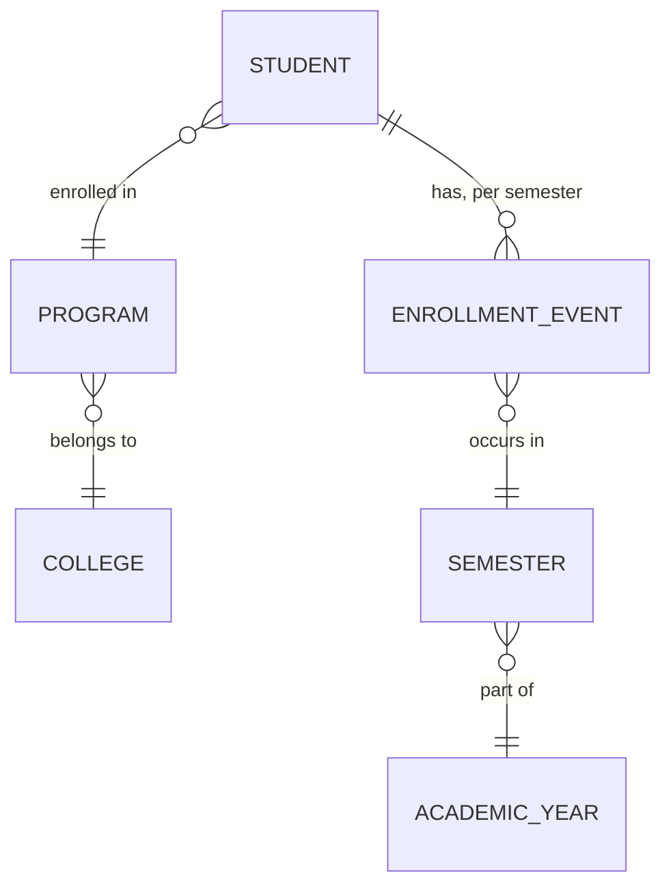
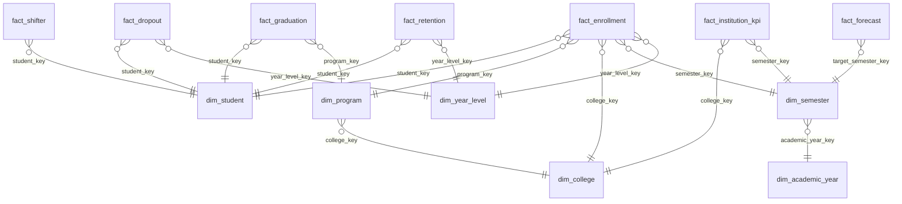

# 04 — Data Modeling

## 1. Conceptual Model

At the conceptual level, the domain is simple: **Students** are enrolled in a **Program** (belonging to a **College**) during a **Semester** of an **Academic Year**. Each semester, a student has an **outcome**: continues, graduates, drops out, or shifts programs. These outcomes, aggregated over time, produce **institutional KPIs**.

**Academic period grain (authoritative — see `01_Project_Overview.md` §4):** 3 academic years (`2021-2022`, `2022-2023`, `2023-2024`), each with a 1st and 2nd Semester → **6 academic semesters** in scope. `academic_year` is a school-year label, not a single calendar year — this is a deliberate correction from an earlier draft that modeled 4 single-year labels (8 semester-periods); see the migration note in `01_Project_Overview.md`.

**Year-level domain (explicit, not freshman-only):** `Freshman, Sophomore, Junior, Senior, Super Senior`, with `Graduate` as the terminal state. Every fact and aggregate in this document is designed to be sliceable by `year_level`, not just by entering cohort — otherwise the warehouse can answer "how many freshmen enrolled" but not "how many seniors were enrolled in College X during 2022-2023, 2nd Semester," which is exactly the kind of question this platform exists to answer.

## 2. Why Dimensional Modeling (Star Schema) Over a Normalized OLTP Model

The source-of-truth registrar system (real or simulated) is OLTP-shaped — normalized, optimized for transactional writes. The warehouse's job is the opposite: fast, intuitive **analytical reads** — "success rate by college by year" style queries. Kimball's dimensional modeling approach (facts + dimensions) is the industry-standard answer to this because:

- Business users and BI tools understand "facts you can measure" + "dimensions you slice by" intuitively — it maps to how administrators already think ("show me graduates, by college, by year").
- Star schemas minimize joins for the common query pattern (one fact table + a handful of dimensions), which matters both for query performance and for query *writability*.
- It decouples the *grain of measurement* (fact tables) from *descriptive context* (dimensions), so dimensions can be reused across many facts (e.g., `dim_program` is shared by `fact_enrollment`, `fact_graduation`, `fact_dropout`).

### Star vs. Snowflake — Decision

| | Star Schema | Snowflake Schema |
|---|---|---|
| Dimension structure | Denormalized (flat) | Normalized (dimensions split into sub-tables) |
| Query simplicity | Fewer joins, simpler SQL | More joins needed |
| Storage | Slightly more redundant | More storage-efficient |
| Best for | BI/dashboard-heavy workloads | Very large, slowly-changing dimension hierarchies with strict normalization needs |

**Recommendation: Star Schema.** The dimension hierarchies here (college → program, calendar → semester → academic year) are shallow and don't change structure often. Snowflaking would only add join complexity for no real storage or integrity benefit at this data volume (tens of thousands of rows, not billions). This is a case where following "best practice" blindly (snowflake = "more normalized = better") would be the wrong call — the right model choice depends on data shape and query pattern, not on which one sounds more sophisticated. This choice is unaffected by the academic-year model correction.

## 3. Logical Model — Dimensions

### `dim_student`
| Column | Type | Notes |
|---|---|---|
| `student_key` (PK, surrogate) | INT | Auto-increment |
| `student_id` (natural key) | VARCHAR | Original SIS ID |
| `gender` | VARCHAR | |
| `birth_year` | INT | For age-cohort analysis |
| `home_province` | VARCHAR | |
| `admission_type` | VARCHAR | Freshman / Transferee |
| `_valid_from`, `_valid_to`, `_is_current` | DATE/BOOLEAN | **SCD Type 2** |

**Why SCD Type 2 for `dim_student`:** a student's program can change (shifter!) and this change is exactly what the business wants to analyze historically — "how many students shifted out of BSIT in 2023-2024?" requires knowing what a student's dimension attributes *were* at the time of each fact event, not just their current state. Overwriting (SCD Type 1) would silently corrupt historical shifter/retention analysis.

### `dim_program`
`program_key` (surrogate), `program_id` (natural), `program_name`, `program_level` (Bachelor/Certificate/Diploma), `college_key` (FK) — SCD Type 1 (program names rarely change, and when they do, we don't need historical versions of the *name*, just the current one, since program identity is tracked by `program_id`).

### `dim_college`
`college_key`, `college_id`, `college_name` — SCD Type 1.

### `dim_semester`
`semester_key`, `semester_id` (`{academic_year}-{semester_number}`, e.g. `2022-2023-1`), `semester_number` (1 or 2), `academic_year_key` (FK) — a **degenerate-adjacent** dimension: small (6 rows total across the 3 in-scope academic years), static, rebuilt in full each time (Type 1, effectively a lookup).

### `dim_academic_year`
`academic_year_key`, `year_label` (`2021-2022`, `2022-2023`, or `2023-2024` — the actual NEUST school-year label, never a bare single year), `start_calendar_year`, `end_calendar_year` (e.g. 2022 / 2023 for `year_label='2022-2023'`).

### `dim_year_level`
`year_level_key`, `year_level_name` (`Freshman`, `Sophomore`, `Junior`, `Senior`, `Super Senior`), `year_level_rank` (1–5, for ordering in charts/reports without relying on string sort). Added explicitly so year-level analytics are a first-class, independently queryable dimension rather than an unenumerated free-text column — this is the direct fix for the "freshman-only" framing an earlier draft of this project was criticized for.

### `dim_calendar` (Date Dimension)
Standard date dimension: `date_key`, `full_date`, `year`, `quarter`, `month`, `day`, `is_semester_start`, `is_semester_end`, `academic_year_key`. Included because forecasting and trend analysis need standard time-grain rollups (month/quarter) that `dim_semester` alone can't provide.

### Junk Dimension: `dim_enrollment_status_flags`
Combines low-cardinality boolean/categorical flags that don't deserve their own dimension table (e.g., `is_scholar`, `is_working_student`, `has_financial_aid`) into one small dimension — avoids fact tables with 6+ tiny FK columns for flags that are almost never queried independently.

## 4. Logical Model — Fact Tables

All fact tables share these **audit/lineage columns**: `_batch_id`, `_loaded_at`, `_source_silver_table`.

### `fact_enrollment` — grain: one row per student per semester
`student_key`, `program_key`, `college_key`, `semester_key`, `academic_year_key`, `year_level_key`, `enrollment_status` (enrolled/on-leave), `units_enrolled`, `is_new_enrollee` (measure/flag).

### `fact_graduation` — grain: one row per student per graduation event
`student_key`, `program_key`, `college_key`, `semester_key`, `graduation_date_key`, `years_to_complete` (measure).

### `fact_dropout` — grain: one row per student per dropout event
`student_key`, `program_key`, `college_key`, `semester_key`, `year_level_key`, `dropout_reason` (degenerate dimension), `semesters_completed_before_dropout`.

### `fact_shifter` — grain: one row per shift event
`student_key`, `from_program_key`, `to_program_key`, `semester_key`, `shift_reason`.

### `fact_retention` — grain: one row per student per cohort-semester pair
`student_key`, `cohort_academic_year_key`, `program_key`, `semester_key`, `year_level_key`, `is_retained` (measure, boolean-as-int for SUM aggregation).

### `fact_institution_kpi` — grain: one row per college per semester (pre-aggregated Gold KPI table)
`college_key`, `semester_key`, `academic_year_key`, `enrollment_count`, `graduation_count`, `dropout_count`, `shifter_count`, `retention_rate`, `graduation_rate`, `dropout_rate`, `success_rate` (see `09_Data_Science.md`). **Expected row count: 8 colleges × 6 semesters = 48 rows** — down from the previous (incorrect) 64-row estimate that assumed an 8-semester model.

### `fact_forecast` — grain: one row per (metric, program/college, forecasted semester, model_version)
`entity_key` (program or college), `metric_name` (enrollment/graduates/population), `target_semester_key`, `forecast_value`, `lower_bound`, `upper_bound`, `model_version`, `generated_at`.

## 5. Keys — Design Rationale

| Key type | Used for | Why |
|---|---|---|
| **Surrogate keys** (auto-increment INT) | All dimension PKs, referenced by all facts | Insulates the warehouse from source-system ID changes/reuse; required for SCD Type 2 (same natural key, multiple surrogate rows over time) |
| **Natural keys** (`student_id`, `program_id`, `semester_id`) | Stored *inside* dimensions as attributes | Needed to match incoming Silver records to the correct dimension row during `MERGE` |
| **Foreign keys** | Every fact → dimension relationship | Enforces referential integrity; also documents the model's grain implicitly |

Surrogate keys are non-negotiable here specifically *because* of SCD Type 2 on `dim_student` — the natural key `student_id` will map to multiple surrogate rows over time, and facts must point to the surrogate key that was current *at the time of the fact event*, not the current one.

## 6. Bridge Tables

Not required in the current scope — there's no natural many-to-many relationship in this model that isn't already resolved by a fact table (e.g., a student changing programs is fully captured by `fact_shifter` + `dim_student` SCD2, not a bridge). Noted here explicitly so the decision reads as deliberate, not an oversight.

## 7. Full Star Schema Diagram

## 8. Physical Model Notes

- All fact tables are partitioned (logically, via `academic_year_key`) to support incremental Gold rebuilds without full-table rewrites.
- Indexes: B-tree on every FK column in fact tables; composite index on `(college_key, semester_key)` on `fact_institution_kpi` since that's the dominant query pattern for any consumer (Web Team included).
- `dim_student` SCD2 uses a partial unique index on `(student_id) WHERE _is_current = true` to guarantee exactly one current row per student.

## 9. Implementation Notes — Dimension & Fact Tables

> **⚠️ STALE — pending regeneration.** The prior version of this section reported concrete, real results from a build run against the **old 8-semester academic-year model** (e.g., 8,012 `dim_student` rows for 7,800 students, exact fact row counts, a specific SCD2 entry-semester-shift bug fix). That academic-year model has been replaced by the 6-semester model in §1 above, so those exact counts no longer describe this project and must be re-derived once `data_generator` and the Gold build are re-run against the corrected calendar. The **design decisions and lessons below remain valid** and are kept for that reason — only the numbers are stale.

**Design decisions carried forward unchanged:**
1. `_valid_from`/`_valid_to` are modeled as `_valid_from_semester_key`/`_valid_to_semester_key` (FKs into `dim_semester`), not literal dates — this project has no literal date fields anywhere in its source model, only `academic_year` + `semester_number`.
2. SCD2 history-building (`build_dim_student`) is written in plain Python, not DuckDB SQL, despite this project's general preference for DuckDB SQL transforms. Cleaning and dedup are naturally set-based; SCD2 construction is inherently *sequential* per student — using the right tool per sub-problem, not the same tool everywhere.
3. A real, previously-found bug is worth re-testing for, not just re-fixing blindly: a student who shifts programs in their *entry* semester has no valid "prior period" to close a dimension row at. The regression test for this (`test_student_who_shifts_in_their_entry_semester_gets_exactly_one_row`) should be re-run — and is expected to still matter — under the corrected 6-semester calendar, since the underlying mechanic (shift-in-entry-semester) doesn't depend on how many semesters are in scope.

**`dim_calendar`'s disclosed simplification, updated:** the institution's actual academic calendar is now explicit (`2021-2022`, `2022-2023`, `2023-2024`, 2 semesters each) via `configs/academic_calendar.yaml`, rather than an assumed Jan–Jun/Jul–Dec split of a single calendar year. `dim_calendar` should derive semester start/end from that config, not from an inferred convention — this removes a simplification the earlier design had to disclose.

**Where Postgres isn't yet involved:** Gold tables are written to `warehouse/gold_store/` as Parquet via the same `ObjectStorage` abstraction used for Bronze/Silver, since this sandbox has no running Postgres. Materializing these into the real warehouse only changes the write target, not the transformation logic — unaffected by the academic-year correction.

**Testing:** the existing test suites (`test_build_dimensions.py`, `test_build_facts.py`) keep their structure; fixture data and any hardcoded semester-count assertions (e.g., "8 semesters," "64 KPI rows") need updating to the 6-semester grain (`48 KPI rows` for `fact_institution_kpi`) before they can be trusted again.

---
*Next: `05_Medallion_Architecture.md` — Bronze/Silver/Gold implementation detail.*