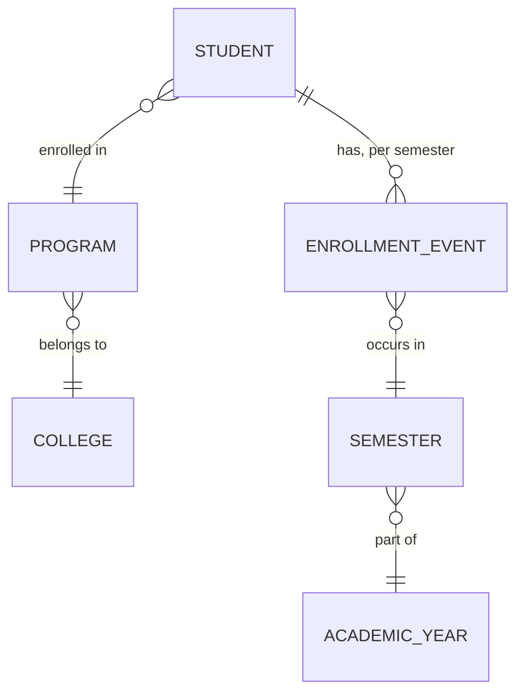
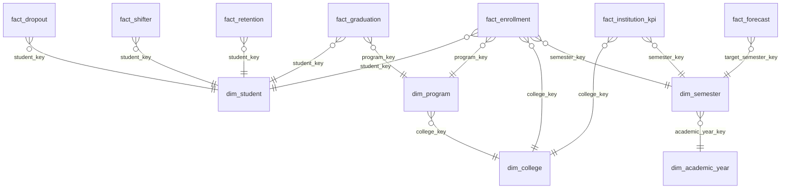

# 04 — Data Modeling

## 1. Conceptual Model

At the conceptual level, the domain is simple: **Students** are enrolled in a **Program** (belonging to a **College**) during a **Semester** of an **Academic Year**. Each semester, a student has an **outcome**: continues, graduates, drops out, or shifts programs. These outcomes, aggregated over time, produce **institutional KPIs**.

## 2. Why Dimensional Modeling (Star Schema) Over a Normalized OLTP Model

The source-of-truth registrar system (real or simulated) is OLTP-shaped — normalized, optimized for transactional writes. The warehouse's job is the opposite: fast, intuitive **analytical reads** — "success rate by college by year" style queries. Kimball's dimensional modeling approach (facts + dimensions) is the industry-standard answer to this because:

- Business users and BI tools understand "facts you can measure" + "dimensions you slice by" intuitively — it maps to how administrators already think ("show me graduates, by college, by year").
- Star schemas minimize joins for the common query pattern (one fact table + a handful of dimensions), which matters both for query performance and for query *writability*.
- It decouples the *grain of measurement* (fact tables) from *descriptive context* (dimensions), so dimensions can be reused across many facts (e.g., `dim_program` is shared by `fact_enrollment`, `fact_graduation`, `fact_dropout`).

### Star vs. Snowflake — Decision

| | Star Schema | Snowflake Schema |
|---|---|---|
| Dimension structure | Denormalized (flat) | Normalized (dimensions split into sub-tables) |
| Query simplicity | Fewer joins, simpler SQL | More joins needed |
| Storage | Slightly more redundant | More storage-efficient |
| Best for | BI/dashboard-heavy workloads | Very large, slowly-changing dimension hierarchies with strict normalization needs |

**Recommendation: Star Schema.** The dimension hierarchies here (college → program, calendar → semester → academic year) are shallow and don't change structure often. Snowflaking would only add join complexity for no real storage or integrity benefit at this data volume (tens of thousands of rows, not billions). This is a case where following "best practice" blindly (snowflake = "more normalized = better") would be the wrong call — the right model choice depends on data shape and query pattern, not on which one sounds more sophisticated.

## 3. Logical Model — Dimensions

### `dim_student`
| Column | Type | Notes |
|---|---|---|
| `student_key` (PK, surrogate) | INT | Auto-increment |
| `student_id` (natural key) | VARCHAR | Original SIS ID |
| `gender` | VARCHAR | |
| `birth_year` | INT | For age-cohort analysis |
| `home_province` | VARCHAR | |
| `admission_type` | VARCHAR | Freshman / Transferee |
| `_valid_from`, `_valid_to`, `_is_current` | DATE/BOOLEAN | **SCD Type 2** |

**Why SCD Type 2 for `dim_student`:** a student's program can change (shifter!) and this change is exactly what the business wants to analyze historically — "how many students shifted out of BSIT in 2023?" requires knowing what a student's dimension attributes *were* at the time of each fact event, not just their current state. Overwriting (SCD Type 1) would silently corrupt historical shifter/retention analysis.

### `dim_program`
`program_key` (surrogate), `program_id` (natural), `program_name`, `program_level` (Bachelor/Certificate/Diploma), `college_key` (FK) — SCD Type 1 (program names rarely change, and when they do, we don't need historical versions of the *name*, just the current one, since program identity is tracked by `program_id`).

### `dim_college`
`college_key`, `college_id`, `college_name` — SCD Type 1.

### `dim_semester`
`semester_key`, `semester_id`, `semester_number` (1 or 2), `academic_year_key` (FK), `start_date`, `end_date` — this is a **degenerate-adjacent** dimension: small, static, rebuilt in full each time (Type 1, effectively a lookup).

### `dim_academic_year`
`academic_year_key`, `year_label` (e.g. "2023-2024"), `start_year`, `end_year`.

### `dim_calendar` (Date Dimension)
Standard date dimension: `date_key`, `full_date`, `year`, `quarter`, `month`, `day`, `is_semester_start`, `is_semester_end`, `academic_year_key`. Included because forecasting and trend analysis need standard time-grain rollups (month/quarter) that `dim_semester` alone can't provide.

### Junk Dimension: `dim_enrollment_status_flags`
Combines low-cardinality boolean/categorical flags that don't deserve their own dimension table (e.g., `is_scholar`, `is_working_student`, `has_financial_aid`) into one small dimension — avoids fact tables with 6+ tiny FK columns for flags that are almost never queried independently.

## 4. Logical Model — Fact Tables

All fact tables share these **audit/lineage columns**: `_batch_id`, `_loaded_at`, `_source_silver_table`.

### `fact_enrollment` — grain: one row per student per semester
`student_key`, `program_key`, `college_key`, `semester_key`, `academic_year_key`, `enrollment_status` (enrolled/on-leave), `year_level`, `units_enrolled`, `is_new_enrollee` (measure/flag).

### `fact_graduation` — grain: one row per student per graduation event
`student_key`, `program_key`, `college_key`, `semester_key`, `graduation_date_key`, `years_to_complete` (measure).

### `fact_dropout` — grain: one row per student per dropout event
`student_key`, `program_key`, `college_key`, `semester_key`, `dropout_reason` (degenerate dimension), `semesters_completed_before_dropout`.

### `fact_shifter` — grain: one row per shift event
`student_key`, `from_program_key`, `to_program_key`, `semester_key`, `shift_reason`.

### `fact_retention` — grain: one row per student per cohort-semester pair
`student_key`, `cohort_academic_year_key`, `program_key`, `semester_key`, `is_retained` (measure, boolean-as-int for SUM aggregation).

### `fact_institution_kpi` — grain: one row per college per semester (pre-aggregated Gold KPI table)
`college_key`, `semester_key`, `academic_year_key`, `enrollment_count`, `graduation_count`, `dropout_count`, `shifter_count`, `retention_rate`, `graduation_rate`, `dropout_rate`, `success_rate` (see `09_Data_Science.md`).

### `fact_forecast` — grain: one row per (metric, program/college, forecasted semester, model_version)
`entity_key` (program or college), `metric_name` (enrollment/graduates/population), `target_semester_key`, `forecast_value`, `lower_bound`, `upper_bound`, `model_version`, `generated_at`.

## 5. Keys — Design Rationale

| Key type | Used for | Why |
|---|---|---|
| **Surrogate keys** (auto-increment INT) | All dimension PKs, referenced by all facts | Insulates the warehouse from source-system ID changes/reuse; required for SCD Type 2 (same natural key, multiple surrogate rows over time) |
| **Natural keys** (`student_id`, `program_id`) | Stored *inside* dimensions as attributes | Needed to match incoming Silver records to the correct dimension row during `MERGE` |
| **Foreign keys** | Every fact → dimension relationship | Enforces referential integrity; also documents the model's grain implicitly |

Surrogate keys are non-negotiable here specifically *because* of SCD Type 2 on `dim_student` — the natural key `student_id` will map to multiple surrogate rows over time, and facts must point to the surrogate key that was current *at the time of the fact event*, not the current one.

## 6. Bridge Tables

Not required in the current scope — there's no natural many-to-many relationship in this model that isn't already resolved by a fact table (e.g., a student changing programs is fully captured by `fact_shifter` + `dim_student` SCD2, not a bridge). Noted here explicitly so the decision reads as deliberate, not an oversight: a bridge table would become necessary if, e.g., students could be enrolled in multiple concurrent programs (dual-degree), which the source data does not model.

## 7. Full Star Schema Diagram

## 8. Physical Model Notes

- All fact tables are partitioned (logically, via `academic_year_key`) to support incremental Gold rebuilds without full-table rewrites.
- Indexes: B-tree on every FK column in fact tables; composite index on `(college_key, semester_key)` on `fact_institution_kpi` since that's the dashboard's dominant query pattern.
- `dim_student` SCD2 uses a partial unique index on `(student_id) WHERE _is_current = true` to guarantee exactly one current row per student.

## 9. Implementation Notes — Dimension Tables (Day 12)

**Module:** `pipelines/gold/build_dimensions.py`, run via `python -m pipelines.gold.build_dimensions`.

**Two adaptations from this document's original design, made explicit rather than silently reconciled:**
1. `_valid_from`/`_valid_to` were originally specified as `DATE`. This project has no literal date fields anywhere in its model — only `academic_year` + `semester_number`. The honest equivalent, actually implemented, is `_valid_from_semester_key`/`_valid_to_semester_key`, both FKs into `dim_semester`.
2. SCD2 history-building (`build_dim_student`) is written in plain Python, not DuckDB SQL, despite this project's stated preference for DuckDB SQL transforms (`07_Technology_Stack.md`). Cleaning (Day 10) and dedup (Day 11) are naturally set-based — exactly what SQL is good at. SCD2 construction is inherently *sequential* per student (open a row, watch for a shift, close it, open the next). Forcing that into one complex window-function SQL expression would trade clarity for a consistency that isn't worth it — using the right tool per sub-problem, not the same tool everywhere, is the actual judgment being exercised here.

**A real bug, found by running against real data, not by review.** The first implementation closed a shifted student's prior SCD2 row at `shift_semester - 1`. That's correct for the common case — but 35 of Day 5's 352 shifters shifted in their *entry* semester itself (Day 5's `simulate_student` applies the shift check before emitting that semester's own enrollment record, so even the very first observed record already reflects the post-shift program). For those students, "the semester before entry" doesn't exist, and the lookup silently returned `None` — producing a "closed" row with a nonsensical null `_valid_to_semester_key`. Caught by checking the actual output (`non_current["_valid_to_semester_key"].isna().sum()` was 35, not 0) rather than assuming a design that looked complete on paper was complete in practice. **Fix:** when a shift's semester equals the entry semester, there's no observable "before" period at all — the student gets exactly one row, open, already reflecting the post-shift program, instead of two rows where the first is unclosable. This exact scenario is now a permanent regression test (`test_student_who_shifts_in_their_entry_semester_gets_exactly_one_row`).

**Confirmed against real data, after the fix:** 8,012 `dim_student` rows for 7,800 students — 7,588 with exactly one (never-shifted or entry-shifted) row, 212 shifted students with two properly-closed rows. Every one of the 7,800 students has **exactly one** current row (Day 12's validation checklist, checked directly, not assumed) and **zero** non-current rows with a null `_valid_to_semester_key` (down from 35 before the fix).

**`dim_calendar`'s disclosed simplification:** the project brief specifies two semesters per academic year but never literal semester start/end dates. `dim_calendar` assumes semester 1 = Jan 1–Jun 30 and semester 2 = Jul 1–Dec 31 of the same calendar year — consistent with how `academic_year` is used everywhere else in this project as a single calendar year, not a split year. A real deployment would replace this with the institution's actual registrar calendar.

**Where Postgres isn't yet involved:** Gold tables are written to `warehouse/gold_store/` as Parquet via the same `ObjectStorage` abstraction used for Bronze/Silver — this sandbox has no running Postgres (see Day 2's note). Materializing these into the real warehouse is Week 3's job; only the storage target changes, not this logic.

**Testing:** `tests/unit/test_build_dimensions.py` — 14 tests, including the entry-semester-shift regression test above and a broader property test (`test_dim_student_exactly_one_current_row_per_student_at_scale`) across a mix of never-shifted, mid-history-shifted, and entry-semester-shifted students confirming the "exactly one current row per student" invariant holds generally, not just for the one case that happened to break.

## 10. Implementation Notes — Fact Tables (Day 13)

**Module:** `pipelines/gold/build_facts.py`, run via `python -m pipelines.gold.build_facts`.

**The centerpiece: an AS-OF join against `dim_student`'s SCD2 history, not a lookup against "the current row."** Every fact table resolves `student_key` via `resolve_student_key_as_of()` — a DuckDB SQL join matching each enrollment/graduation/dropout/shifter row's own semester against the `dim_student` row whose `[_valid_from_semester_key, _valid_to_semester_key]` range actually contains it. This is the entire reason Day 12 built real SCD2 history instead of just overwriting `dim_student` in place: a pre-shift enrollment record must resolve to the *old* dimension row, not the student's current one, or every pre-shift semester would incorrectly appear to have always been in the post-shift program. Verified directly with a two-student, one-shift fixture: a 2021-1 (pre-shift) enrollment record resolves to `student_key=1`, and the 2021-2 (post-shift) record for the *same student* resolves to `student_key=2` — proving the join is time-aware, not just student-aware.

**Row counts reconcile exactly against Silver — checked, not assumed:** `fact_enrollment` (32,701), `fact_graduation` (965), `fact_dropout` (1,255), `fact_shifter` (352) all match their Silver source counts precisely, meaning none of the dimension-key joins (an easy place for an inner join to silently drop unmatched rows) lost anything.

**`fact_retention`'s grain is deliberately narrower than "every enrollment row."** Two categories of row are excluded, not mislabeled: rows already `GRADUATED` (there's nothing left to "retain" past graduation), and rows at the final observed semester (2024-2 — there's no subsequent semester to check, so retention there is *undefined*, not *false*). `is_retained = 1` only if the student has an `ENROLLED` or `GRADUATED` record in the immediately following semester; a dropout or simply no further record both correctly yield `0`.

**On "MERGE/upsert" vs. full rebuild — an adaptation from the original roadmap wording, made explicit:** `docs/12_Implementation_Roadmap.md` describes fact loads as keyed `MERGE`/upsert, which assumes an incrementally-maintained warehouse table. At this data volume (tens of thousands of rows), Gold facts are instead **fully rebuilt from Silver on every run** — simpler than incremental merge, and it sidesteps an entire class of incremental-merge bugs (partial updates, forgotten backfills, drift between merge logic and full-rebuild logic) that wouldn't be worth the complexity here. Idempotency is achieved just as genuinely, differently: the same Silver input always produces the exact same Gold output. Proven directly — running `build_all_facts()` twice against the real dataset produces **identical** row counts across all five facts, and a separate fixture-based test confirms the *content* doesn't duplicate either (re-running overwrites, not appends).

**Testing:** `tests/unit/test_build_facts.py` — 12 tests: the AS-OF join proven correct across pre-shift, post-shift, and never-shifted students; row-count reconciliation for each fact; `fact_retention`'s exclusion rules (graduated, final-semester) and both retained/not-retained outcomes; and a full idempotency test running the entire fact build twice against identical Silver/Gold fixture state.

---
*Next: `05_Medallion_Architecture.md` — Bronze/Silver/Gold implementation detail.*
