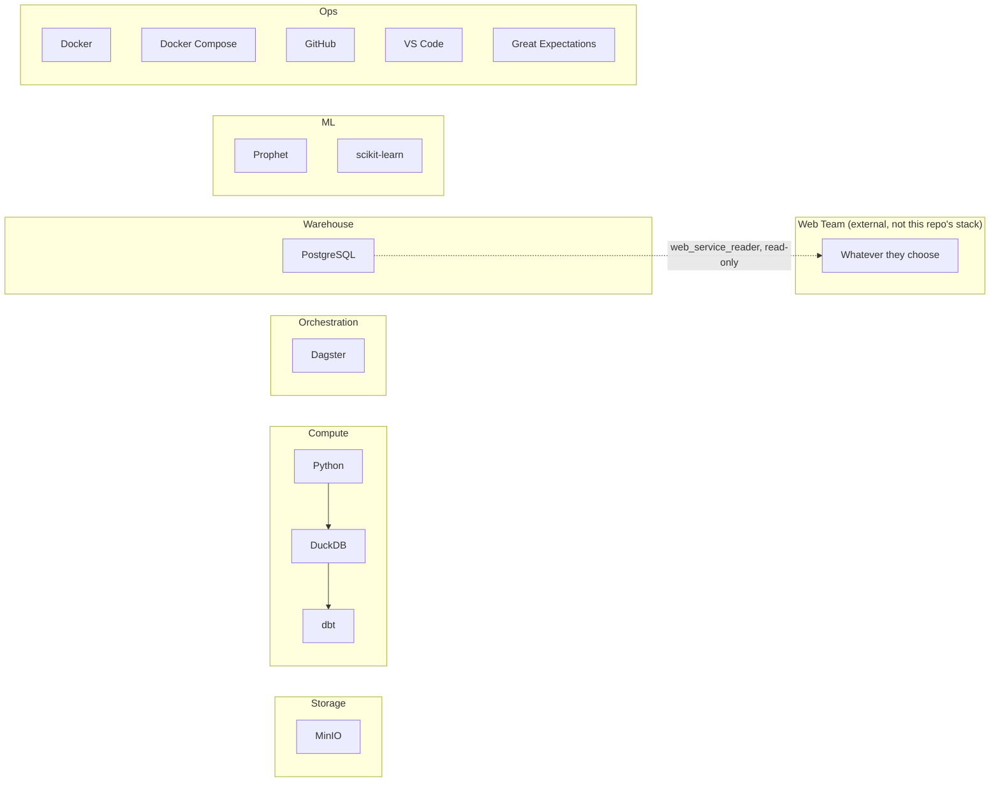

# 07 — Technology Stack

> **Scope note:** this stack covers the **Data Engineering + Data Science service only**. Dashboard/presentation tooling (Superset, Streamlit, or anything else) is the Web Team's choice and is out of scope here — see `01_Project_Overview.md` §8 and `15_Tooling_Responsibility_Matrix.md`.

## 1. Database

| | PostgreSQL | DuckDB | BigQuery |
|---|---|---|---|
| Advantages | Mature, concurrent, free, huge ecosystem (dbt and many BI/consumption tools) | Extremely fast for local analytical/OLAP queries over Parquet, zero server | Serverless, scales to huge data, industry-standard cloud DW |
| Disadvantages | Needs a running server process | Single-process, not built for concurrent multi-user access | Requires billing account, not fully "free," internet dependency |
| Learning curve | Low–medium (near-universal SQL) | Low | Medium (GCP concepts) |
| Scalability | Good to 10s of millions of rows on modest hardware | Great for single-machine analytical workloads | Excellent, effectively unlimited |
| Capstone suitability | **High** — free, local, supports a clean read-only external-consumer role | High as an in-pipeline transform engine | Low — conflicts with free/local constraint |
| Industry adoption | Extremely high | Growing fast, especially in data engineering tooling | Extremely high, but cloud-specific |

**Recommendation: PostgreSQL as warehouse-of-record, DuckDB as an in-pipeline transformation engine for Bronze→Silver→Gold over Parquet.** This mirrors a real pattern (e.g., using DuckDB/Spark for transformation, landing results in a queryable warehouse that a separate consuming team reads from) without requiring cloud infrastructure.

## 2. Pipeline / Processing

| | Python + Pandas | PySpark | DuckDB SQL |
|---|---|---|---|
| Advantages | Simple, huge ecosystem, easy to test | Built for distributed, massive-scale data; industry standard at scale | SQL-native, very fast locally, low overhead |
| Disadvantages | Doesn't scale beyond single-machine memory | Heavy operational overhead (cluster/session management) for a dataset this small | Less familiar to some; not distributed |
| Learning curve | Low | Medium–high | Low (if SQL is known) |
| Scalability | Limited (in-memory) | Very high | High for single-node |
| Capstone suitability | High for orchestration/glue code | **Low** — massive overkill for ~tens of thousands of rows | High for the actual heavy transform SQL |
| Industry adoption | Universal | Very high at large-scale companies | Fast-growing |

**Recommendation: Python (Pandas) for orchestration/glue + validation code, DuckDB SQL for the actual Bronze→Silver→Gold transformations.** PySpark is explicitly *not* used — this project's data volume (thousands to low tens-of-thousands of student records across 3 academic years) doesn't approach the scale where Spark's distributed execution pays for its operational complexity. (Discussed further in `13_Best_Practices.md` and `14_Future_Improvements.md`.)

## 3. Workflow Orchestration

| | Airflow | Prefect | Dagster |
|---|---|---|---|
| Advantages | Industry-standard, huge community | Pythonic, modern UI, easy local dev | Strong data-asset-centric model, excellent for data quality/lineage visibility, great local dev experience |
| Disadvantages | Heavier setup (metadata DB, scheduler, webserver), steeper learning curve for beginners | Smaller enterprise footprint than Airflow | Smaller community than Airflow |
| Learning curve | Medium–high | Low–medium | Low–medium |
| Scalability | Very high | High | High |
| Capstone suitability | Medium — a lot of infra ceremony for a capstone timeline | High | **High** |
| Industry adoption | Very high | Growing | Growing, especially in modern data platform teams |

**Recommendation: Dagster.** Its "software-defined asset" model maps almost one-to-one onto this project's medallion layers (Bronze/Silver/Gold *are* assets), and it has first-class support for asset-level data quality checks and lineage visualization out of the box — directly supporting the "show me the lineage from Gold back to Bronze" capstone defense scenario.

## 4. Analytics Engineering

| | dbt | Traditional hand-written ETL |
|---|---|---|
| Advantages | Version-controlled SQL, built-in testing, auto-generated documentation & lineage graphs | Full flexibility, no framework to learn |
| Disadvantages | Another tool/DSL to learn | Tests and documentation are manual, easy to skip under deadline pressure |
| Capstone suitability | **High** — testing and auto-docs directly satisfy the "data quality" and "documentation" grading criteria, and double as the documented artifact the Web Team can rely on as a contract | Lower — quality/doc discipline has to be self-enforced |
| Industry adoption | Extremely high, the de facto standard for the transformation layer | Still common in legacy systems |

**Recommendation: dbt Core** for the marts layer (Gold → business marts), specifically because its built-in `not_null`/`unique`/`relationships` tests and auto-generated lineage docs turn "we have data quality, documentation, and a stable external contract" into a natural byproduct of doing the transformation work correctly — `dbt docs generate` becomes the literal handoff document for the Web Team.

## 5. Consumption / Presentation (Out of Scope Here)

This project used to own a dashboard stack (Superset + Streamlit) directly. That responsibility has moved to the **Web Team**, who choose and operate their own presentation tooling. This repo's obligation is limited to:

- Publishing stable, tested, documented dbt marts (`dbt/models/marts/`).
- Granting the Web Team a read-only `web_service_reader` role scoped to `gold`/`marts` (see `06_Data_Warehouse.md` §5).
- Maintaining `11_Data_Consumption_Contract.md` as the interface document.

Whatever the Web Team builds on top of that — Superset, Streamlit, a custom web app, anything — is a decision this repo doesn't make and doesn't need to evaluate.

## 6. Machine Learning

| | Prophet | Scikit-learn | TensorFlow |
|---|---|---|---|
| Advantages | Built for exactly this problem shape (business time series with seasonality/trend), interpretable components | Flexible, huge algorithm library, easy to explain feature importance | Powerful for deep learning / large sequence models |
| Disadvantages | Less flexible outside time-series-with-seasonality use cases | Requires manual feature engineering for time series (lags, rolling windows) | Overkill and data-hungry for only 6 semesters of history per program |
| Learning curve | Low | Low–medium | Medium–high |
| Capstone suitability | **High** for the primary forecasting model | High, used for feature-engineered regression comparison in evaluation | **Low** — an LSTM needs far more historical data points than 6 semesters per series provides; will overfit and be uninterpretable to a capstone panel |
| Industry adoption | High, especially for business forecasting | Universal | High, but for very different problem scales |

Full model selection and justification is in `10_Forecasting.md` — the summary conclusion is **Prophet** as the primary forecasting engine, with a **scikit-learn regression baseline** used specifically as a comparison point during model evaluation (not deployed). Note that with the corrected 6-semester academic calendar (down from the previously mis-modeled 8), the data-volume argument against LSTM/deep models is *even stronger* than before — see `10_Forecasting.md` §2 for the updated discussion.

## 7. Final Open-Source Stack (No Paid Services, Anywhere) — DE/DS Scope

| Component | Choice |
|---|---|
| Language | Python 3.11 |
| Object storage | MinIO |
| In-pipeline transform engine | DuckDB |
| Warehouse | PostgreSQL |
| Analytics engineering | dbt Core |
| Orchestration | Dagster |
| Data quality | Great Expectations (or dbt tests — see `13_Best_Practices.md` for the tradeoff) |
| Consumption interface | dbt marts + `web_service_reader` role (no dashboard tooling owned here) |
| Forecasting | Prophet (baseline comparison: scikit-learn) |
| Containerization | Docker + Docker Compose |
| Version control | GitHub |
| IDE | VS Code |

Every component here has a genuinely free, self-hostable open-source edition, and the entire stack starts with a single `docker compose up` — a deliberate reproducibility requirement so the project can be graded, demoed, or extended later without any paid dependency ever entering the picture, and without this repo needing to stand up or maintain anyone else's presentation layer.

---
*Next: `08_Faker_Data_Generator.md` — synthetic data design.*