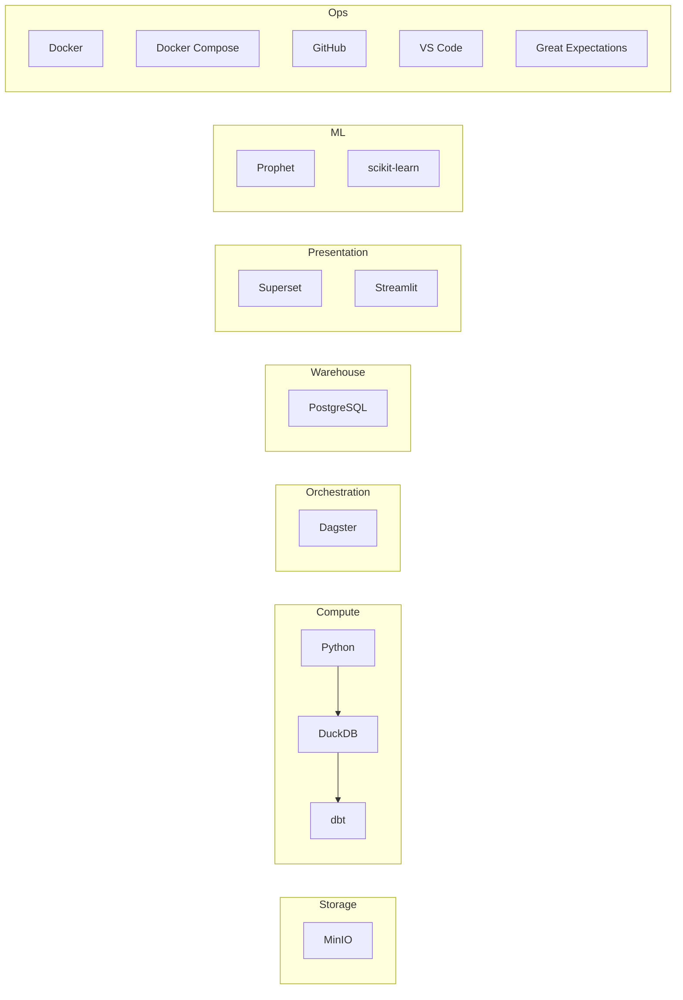

# 07 — Technology Stack

## 1. Database

| | PostgreSQL | DuckDB | BigQuery |
|---|---|---|---|
| Advantages | Mature, concurrent, free, huge ecosystem (dbt, Superset, Metabase) | Extremely fast for local analytical/OLAP queries over Parquet, zero server | Serverless, scales to huge data, industry-standard cloud DW |
| Disadvantages | Needs a running server process | Single-process, not built for concurrent multi-user access | Requires billing account, not fully "free," internet dependency |
| Learning curve | Low–medium (near-universal SQL) | Low | Medium (GCP concepts) |
| Scalability | Good to 10s of millions of rows on modest hardware | Great for single-machine analytical workloads | Excellent, effectively unlimited |
| Capstone suitability | **High** — free, local, works with the whole OSS BI stack | High as an in-pipeline transform engine | Low — conflicts with free/local constraint |
| Industry adoption | Extremely high | Growing fast, especially in data engineering tooling | Extremely high, but cloud-specific |

**Recommendation: PostgreSQL as warehouse-of-record, DuckDB as an in-pipeline transformation engine for Bronze→Silver→Gold over Parquet.** This mirrors a real pattern (e.g., using DuckDB/Spark for transformation, landing results in a queryable warehouse) without requiring cloud infrastructure.

## 2. Pipeline / Processing

| | Python + Pandas | PySpark | DuckDB SQL |
|---|---|---|---|
| Advantages | Simple, huge ecosystem, easy to test | Built for distributed, massive-scale data; industry standard at scale | SQL-native, very fast locally, low overhead |
| Disadvantages | Doesn't scale beyond single-machine memory | Heavy operational overhead (cluster/session management) for a dataset this small | Less familiar to some; not distributed |
| Learning curve | Low | Medium–high | Low (if SQL is known) |
| Scalability | Limited (in-memory) | Very high | High for single-node |
| Capstone suitability | High for orchestration/glue code | **Low** — massive overkill for ~tens of thousands of rows; the operational cost teaches Spark ceremony, not data engineering | High for the actual heavy transform SQL |
| Industry adoption | Universal | Very high at large-scale companies | Fast-growing |

**Recommendation: Python (Pandas) for orchestration/glue + validation code, DuckDB SQL for the actual Bronze→Silver→Gold transformations.** PySpark is explicitly *not* used — this project's data volume (thousands to low tens-of-thousands of student records across 4 years) doesn't approach the scale where Spark's distributed execution pays for its operational complexity. Using Spark here would be cargo-culting a big-data tool onto a small-data problem — the honest engineering judgment is to name that tradeoff rather than use Spark "because it's what industry uses," since industry uses it for data volumes this project does not have. (Spark is discussed conceptually in `13_Best_Practices.md` and noted in `14_Future_Improvements.md` as the natural next step if data volume grew by orders of magnitude — e.g., multi-campus, multi-university scale.)

## 3. Workflow Orchestration

| | Airflow | Prefect | Dagster |
|---|---|---|---|
| Advantages | Industry-standard, huge community | Pythonic, modern UI, easy local dev | Strong data-asset-centric model, excellent for data quality/lineage visibility, great local dev experience |
| Disadvantages | Heavier setup (metadata DB, scheduler, webserver), steeper learning curve for beginners | Smaller enterprise footprint than Airflow | Smaller community than Airflow |
| Learning curve | Medium–high | Low–medium | Low–medium |
| Scalability | Very high | High | High |
| Capstone suitability | Medium — a lot of infra ceremony for a capstone timeline | High | **High** |
| Industry adoption | Very high | Growing | Growing, especially in modern data platform teams |

**Recommendation: Dagster.** Its "software-defined asset" model maps almost one-to-one onto this project's medallion layers (Bronze/Silver/Gold *are* assets), and it has first-class support for asset-level data quality checks and lineage visualization out of the box — which directly supports the "show me the lineage from Gold back to Bronze" capstone defense scenario. Airflow is the safe "everyone uses it" choice and is documented as a valid alternative, but its DAG-of-tasks model (rather than asset model) is a slightly worse conceptual fit here, and its operational setup cost is disproportionate to a one-month solo project.

## 4. Analytics Engineering

| | dbt | Traditional hand-written ETL |
|---|---|---|
| Advantages | Version-controlled SQL, built-in testing, auto-generated documentation & lineage graphs | Full flexibility, no framework to learn |
| Disadvantages | Another tool/DSL to learn | Tests and documentation are manual, easy to skip under deadline pressure |
| Capstone suitability | **High** — testing and auto-docs directly satisfy the "data quality" and "documentation" grading criteria with minimal extra work | Lower — quality/doc discipline has to be self-enforced |
| Industry adoption | Extremely high, the de facto standard for the transformation layer | Still common in legacy systems |

**Recommendation: dbt Core** for the marts layer (Gold → business marts), specifically because its built-in `not_null`/`unique`/`relationships` tests and auto-generated lineage docs turn "we have data quality and documentation" from a manual writing exercise into a natural byproduct of doing the transformation work correctly.

## 5. Dashboard

| | Superset | Metabase | Streamlit | Power BI |
|---|---|---|---|---|
| Advantages | Rich chart types, native SQL Lab, dashboards, RBAC, open-source, backed by Apache | Very easy setup, friendly UI for non-technical stakeholders | Full custom Python control, great for a bespoke forecast-explorer view | Polished, enterprise-familiar |
| Disadvantages | Slightly heavier setup | Less flexible for highly custom visuals | Requires more manual chart-building code | **Not free/open-source** — licensing cost |
| Learning curve | Medium | Low | Low (if Python known) | Low–medium |
| Capstone suitability | High | High | High, as a complement | **Excluded** — violates free/OSS constraint |
| Industry adoption | High, growing | Growing, especially SMB | Growing fast for data-app prototyping | Very high (excluded here on cost grounds only) |

**Recommendation: Apache Superset as the primary dashboard suite** (Executive/College/Program/KPI dashboards, described in `11_Dashboard.md`), **with a small Streamlit app as a secondary "Forecast Explorer"** — because forecast visualization (confidence intervals, model comparison, interactive "what-if" semester selection) benefits from Streamlit's direct Python/Plotly control in a way that's awkward to build purely in Superset's chart builder. Power BI is excluded solely due to licensing cost, not capability — noted so the exclusion reads as a constraint-driven decision, not ignorance of the tool's strength.

## 6. Machine Learning

| | Prophet | Scikit-learn | TensorFlow |
|---|---|---|---|
| Advantages | Built for exactly this problem shape (business time series with seasonality/trend), interpretable components | Flexible, huge algorithm library, easy to explain feature importance | Powerful for deep learning / large sequence models |
| Disadvantages | Less flexible outside time-series-with-seasonality use cases | Requires manual feature engineering for time series (lags, rolling windows) | Overkill and data-hungry for ~8 semesters of history per program |
| Learning curve | Low | Low–medium | Medium–high |
| Capstone suitability | **High** for the primary forecasting model | High, used for feature-engineered regression comparison in evaluation | **Low** — an LSTM needs far more historical data points than 8–16 semesters per series provides; will overfit and be uninterpretable to a capstone panel |
| Industry adoption | High, especially for business forecasting | Universal | High, but for very different problem scales |

Full model selection and justification is in `10_Forecasting.md` — the summary conclusion is **Prophet** as the primary forecasting engine, with a **scikit-learn regression baseline** used specifically as a comparison point during model evaluation (not deployed).

## 7. Final Open-Source Stack (No Paid Services, Anywhere)

| Component | Choice |
|---|---|
| Language | Python 3.11 |
| Object storage | MinIO |
| In-pipeline transform engine | DuckDB |
| Warehouse | PostgreSQL |
| Analytics engineering | dbt Core |
| Orchestration | Dagster |
| Data quality | Great Expectations (or dbt tests — see `13_Best_Practices.md` for the tradeoff) |
| Dashboard | Apache Superset (+ Streamlit for forecast explorer) |
| Forecasting | Prophet (baseline comparison: scikit-learn) |
| Containerization | Docker + Docker Compose |
| Version control | GitHub |
| IDE | VS Code |

Every component here has a genuinely free, self-hostable open-source edition, and the entire stack starts with a single `docker compose up` — a deliberate reproducibility requirement so the project can be graded, demoed, or extended later without any paid dependency ever entering the picture.

---
*Next: `08_Faker_Data_Generator.md` — synthetic data design.*
