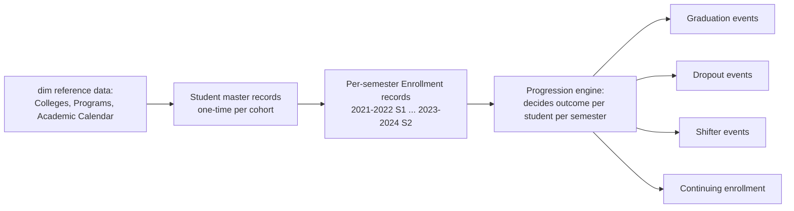

# 08 — Faker Data Generator

## 1. Design Goal

The generator's job is not "produce random rows" — it's to produce a dataset that **behaves like a real university's data would behave**, including the messiness (typos, late corrections, edge cases) that a real Silver layer needs to handle. A too-clean synthetic dataset would make the Silver validation/quality layer pointless to build, since there'd be nothing for it to catch.

> **⚠️ Academic-calendar correction.** This generator now targets NEUST's real academic calendar — **3 academic years (`2021-2022`, `2022-2023`, `2023-2024`), 2 semesters each = 6 academic semesters total** — sourced from `configs/academic_calendar.yaml`, replacing an earlier version that treated 2021/2022/2023/2024 as four independent single-year labels (8 semester-periods). Every count in this document that depended on that old model has been marked stale and needs re-generation; see `01_Project_Overview.md` §4 for the full rationale.

## 2. Folder Structure

> **Naming note:** this package is called `data_generator/`, not `faker/`, even though it's built around the `faker` PyPI library. A folder literally named `faker/` at the repo root silently shadows the installed `faker` package the moment it becomes a real Python package, because the repo root sits ahead of site-packages on `sys.path`. This was caught and fixed before any generator code was written against the colliding name.

> **Reference-data note:** colleges, programs, and the academic calendar are **not** duplicated here. `data_generator` reads `configs/colleges.yaml`, `configs/programs.yaml`, and `configs/academic_calendar.yaml` via `pipelines/common/config.py` — repeating that mapping in a second file would violate the single-source-of-truth principle those configs exist to enforce.

> **Drift correction (P0.34-P0.37):** this section previously described a
> planned structure (`generate_enrollment.py`, `generate_all.py`) that did
> not match the files actually in the repository. The listing below is
> the **actual, current** structure. `generate_all.py` now exists for
> real — see §12.

```
data_generator/
├── config/
│   ├── volumes.yaml                # cohort sizes, college/gender/admission-type weights, risk-profile params
│   ├── admissions_rules.yaml        # yield/acceptance-rate ranges for the derived admissions funnel
│   ├── progression_rules.yaml       # dropout/graduation/shifter probability parameters
│   └── noise_rules.yaml             # typo rate, duplicate rate, late-correction rate
├── generators/
│   ├── generate_students.py
│   ├── generate_admissions.py       # derives the applicants/accepted funnel FROM real enrollment
│   ├── generate_progression.py     # drives dropout/graduation/shifter logic across all year levels
│   ├── apply_noise.py               # final stage: injects realistic messiness (typos/dupes/late corrections)
│   └── generate_all.py             # orchestrates generation order end-to-end; writes manifest.json
├── rules/
│   ├── progression_rules.py        # probability model for student outcomes
│   └── noise_injection.py          # typos, duplicates, nulls
├── validation/
│   └── generate_validation_report.py  # pre-ingestion self-check, run before apply_noise (see §12)
└── output/
    ├── student_master.csv           # cohort-level, generated once — not semester-scoped
    ├── _internal/                    # generator-only state, NEVER treated as source data downstream
    │   └── student_latent_profiles.csv   # per-student risk_score; a real SIS has no such column
    ├── {academic_year}/admissions.csv           # e.g. output/2022-2023/admissions.csv
    ├── {academic_year}/{semester_name}/*.csv    # e.g. output/2022-2023/1st Semester/enrollment.csv
    ├── validation_report.txt        # written by generate_all.py / generate_validation_report.py
    └── manifest.json                 # written by generate_all.py -- see §12
```

The output path segment is the **school-year label** (`2022-2023`), never a bare single year — this is the one place the old model's naming would silently corrupt everything downstream if left unfixed, since ingestion partitions Bronze directly off this folder structure (`05_Medallion_Architecture.md` §2).

## 3. Generation Order (Entity Dependency Graph)



Reference data (colleges, programs, academic calendar) is generated/loaded first and is static across the whole run — it's the "dimension seed" the rest of the generator depends on. Students are generated as **cohorts** (one entry cohort per academic year, e.g., "2021-2022 Freshman Cohort"), and then a **progression engine** runs semester-by-semester over each cohort deciding what happens to each student — this cohort-based approach is what makes retention/graduation-rate analysis meaningful later, since real institutional KPIs are inherently cohort-based ("what % of the 2021-2022 entering cohort graduated by 2023-2024?").

## 4. Business Rules Driving Realism

### Year-Level Coverage (Explicit, All Five Levels)

The generator must produce a population spanning the full progression, not entering students alone:

```text
Student
 ↓
Freshman
 ↓
Sophomore
 ↓
Junior
 ↓
Senior
 ↓
Super Senior
 ↓
Graduate

with branches at every year level:
        ┌── Dropout
        ├── Shift (program change)
Student ┤
        └── Continue
```

Each simulated semester, every active student is evaluated against these branches — this is the direct implementation of `configs/academic_calendar.yaml`'s `year_level` domain and `04_Data_Modeling.md`'s `dim_year_level`, and it's what lets Gold answer "how many seniors were enrolled in College X during 2022-2023, 2nd Semester" rather than only ever answering freshman-entry questions.

### Student Progression Logic
Each student has a **latent "risk profile"** (drawn once at cohort entry, hidden from the data itself) that skews their semester-by-semester outcome probabilities — this simulates the real-world fact that some students are inherently higher-risk (financial, academic, personal factors) without the generator needing to fabricate those underlying reasons.

### Dropout Logic
- Base per-semester dropout probability, higher in year 1 (consistent with real attrition curves).
- Probability increases if `year_level` progression has stalled (re-enrolled in the same year level twice).
- Once dropped, a student generates no further semester enrollment records (terminal state).

### Graduation Logic
- Programs have a `nominal_duration` (from `configs/programs.yaml`, e.g., 4 years for most Bachelor's, 2 years for Certificates).
- A student "eligible" to graduate (reached nominal duration, no dropout) graduates with a probability that increases each semester past nominal duration.
- Graduation is a terminal state — no further enrollment records after.

### Shifter Logic
- A student in year 1 or 2 has a small per-semester probability of shifting programs (shifting after year 2 is rare and modeled as such — reflecting real curriculum lock-in).
- On shift, a `fact_shifter`-source record is generated (`from_program`, `to_program`, `shift_semester`), and the student's subsequent enrollment records use the new program going forward.

### Calibration Against Real Statistical Findings

`data_generator/config/progression_rules.yaml`'s dropout and shifter probabilities are calibrated against real published statistics, not invented, with confidence explicitly documented per parameter:

- **Dropout** (high confidence): calibrated against CHED's reported 35.15% national college attrition rate for SY 2023-2024 (CHED chair Prospero de Vera III, Senate budget deliberations, Oct 2023 — https://newsinfo.inquirer.net/1839954), front-loaded to match published cohort-survival research showing retention is lowest at the first-year level (*Undergraduate Cohort Survival and Retention Rates*, ResearchGate, 2022). **Empirically verified**, not just theoretically derived: after regenerating the dataset with these values and running it through the full pipeline, the 2021 cohort (the most mature — 3 of its nominal 4 years elapsed) shows 29.8% already dropped, with ~64% still enrolled and two nominal years of (lower, later-year) dropout risk remaining. Projecting that remaining exposure lands the cohort's eventual cumulative dropout close to the 35% target once it completes its nominal duration — confirming the calibration, not just asserting it.
- **Shifter** (low-medium confidence, documented as such): the only Philippine-specific figure found was a 31-39% SHS-to-college course mismatch rate (*Exploring Between SHS Strand and College Course Mismatch*, ResearchGate, 2022) — a proxy for "wrong initial fit," not a direct "formally shifted after enrolling" rate. Treated as a soft upper bound. Empirically, the recalibrated config produces an 8.3% shift rate across all cohorts (up from ~5.9% pre-calibration) — reasonable, but acknowledged as the weakest-sourced number in this file.
- **Enrollment volume** (`data_generator/config/volumes.yaml`'s `cohort_sizes`): deliberately left uncalibrated against external research. NEUST-wide enrollment is estimated at ~6,000 students across all six campuses (Grokipedia, uniRank), and the generator's current trajectory (5,700 total, converging toward ~4,800-6,000 active per semester) is broadly consistent with that as a Sumacab-specific estimate — but no public source breaks NEUST's enrollment down by individual campus, so this remains a documented assumption, not a verified figure.
- **Graduation** (`graduation.base_probability`/`ramp_per_extra_semester`): not yet calibrated against the 62.91%/54.09% program-level cohort-survival case study cited above — doing so properly requires the same regenerate-and-measure verification used for dropout above, not a one-off formula change. Tracked as a follow-up.

### Retention Logic
Derived, not directly generated — retention is computed downstream (Gold layer) as "enrolled in consecutive semesters within the same cohort," so the Faker generator only needs to produce consistent semester-by-semester enrollment/outcome records.

### Semester & Academic Year Progression
The generator iterates `for academic_year in ["2021-2022", "2022-2023", "2023-2024"]: for semester_number in [1, 2]:`, applying the progression engine per cohort per semester-step, so cohort tenure (a student's 3rd semester, say) is tracked explicitly and used by the graduation/dropout probability functions above. **This replaces the earlier `for academic_year in [2021, 2022, 2023, 2024]:` loop**, which produced 8 semester-periods instead of the correct 6 and used a bare-year label instead of NEUST's actual school-year label.

## 5. Randomization & Business Rule Summary Table

| Event | Driven by | Realism mechanism |
|---|---|---|
| Enrollment continuation | Latent risk profile + year-level stall count | Correlated risk across semesters, not independent coin flips |
| Dropout | Base rate × year-level modifier × risk profile | Higher attrition in year 1, matches real institutional patterns |
| Graduation | Nominal program duration + probability ramp after nominal duration | Some students finish late, matches real completion timelines |
| Shifter | Year level (only years 1–2) × small base rate | Reflects real curriculum lock-in after year 2 |
| Data noise | `noise_rules.yaml`: typo rate ~2%, duplicate submission rate ~1%, late correction rate ~3% | Gives Silver layer's validation/dedup logic something real to do |

## 6. Constraints & Foreign Keys

- Every generated `program_id` must exist in `configs/programs.yaml` — enforced by generating enrollment records only by sampling from the program list, never free-text.
- Every generated `academic_year` must be one of the 3 values in `configs/academic_calendar.yaml` — enforced the same structural way, and re-validated by Silver's `check_academic_year_in_scope` rule (`05_Medallion_Architecture.md` §3).
- Every `student_id` referenced in enrollment/graduation/dropout/shifter files must exist in the student master file generated first — enforced structurally by generation order, and re-validated by Silver's schema checks (defense in depth).

## 7. Data Volume (Suggested)

| Entity | Volume | Rationale |
|---|---|---|
| Colleges | 8 | Fixed per NEUST Sumacab structure |
| Programs | 37 | Fixed per structure given (see `configs/programs.yaml`) |
| Students (total across all cohorts, 2021-2022 through 2023-2024) | ~6,000–8,000 | Large enough for statistically meaningful retention/success-rate trends per program, small enough to keep local Postgres/DuckDB processing trivially fast |
| Enrollment records | Proportionally lower than the old 8-semester estimate, since there are now 6 semester-observations per student instead of 8 | Recalculate once regenerated — do not reuse the old ~35,000–45,000 estimate directly |
| Graduation events | ~1,500–2,500 | Consistent with realistic 4-year completion rates; expect this to still be constrained by the observation-window truncation noted in §10 below |
| Dropout events | ~800–1,500 | Consistent with realistic attrition rates |
| Shifter events | ~400–700 | Small % of students, concentrated in years 1–2 |

## 8. Validation Rules on Generated Output

Before the generated data is treated as a valid "source system extract" (i.e., before ingestion picks it up), the generator runs a self-check:
- Every student has exactly one terminal outcome or is still active as of 2023-2024, 2nd Semester (no student both graduates and drops out).
- No enrollment record references a nonexistent program/college/academic year.
- Per-cohort dropout + graduation + still-active counts sum to the cohort's total size.

This self-check step matters pedagogically: it's the same discipline as validating any other "source system" — even though you control the generator, you don't get to skip validating its output, because the whole point of the project is to practice treating upstream data as untrusted until proven otherwise.

## 9. Implementation Notes — Student Master Generator

> **⚠️ STALE — pending regeneration.** The specific volume/distribution numbers previously reported here (7,800 students, per-cohort counts, observed vs. configured distributions) were measured under the old 8-semester/single-year model and must be re-measured once the generator is re-run against the corrected calendar. The generator's *design* (two-stage config validation, latent risk score kept out of the public file, distributional self-tests) is unaffected and carries forward unchanged.

**Module:** `data_generator/generators/generate_students.py`, run via `python -m data_generator.generators.generate_students` from the repo root.

**Design decisions unaffected by the calendar correction:**
- Cohort sizing uses a slight year-over-year growth curve (`data_generator/config/volumes.yaml`) so the enrollment trend has something real to show downstream instead of a flat, suspiciously uniform series — now applied across 3 cohorts (2021-2022, 2022-2023, 2023-2024) instead of 4.
- Two-stage validation (shape, then cross-reference against real config) reused from `pipelines.common.config`.
- The latent risk score never touches the public `student_master.csv` — only `output/_internal/student_latent_profiles.csv` sees it.

**Testing:** `tests/unit/test_generate_students.py` — distributional tests (gender, age-offset, risk-score skew, transferee year-level split) remain structurally valid; only cohort-count assertions (previously assuming 4 cohorts) need updating to 3.

## 10. Implementation Notes — Progression Engine

> **⚠️ STALE — pending regeneration.** The specific event counts previously reported here (32,701 enrollment records, 965 graduation events, 1,255 dropout events, 352 shifter events, all measured against 4 cohorts over 8 semester-periods) no longer apply and must be re-measured against 3 cohorts over 6 semester-periods.

**Modules:** `data_generator/rules/progression_rules.py` (pure probability functions) + `data_generator/generators/generate_progression.py` (per-student state machine + full-population orchestration), run via `python -m data_generator.generators.generate_progression`.

**Mechanics (unchanged by the calendar correction):** each student is simulated semester-by-semester from their entry index through 2023-2024, 2nd Semester (or a terminal outcome), in this order each semester: (1) dropout check, (2) graduation check (only once tenure ≥ nominal duration), (3) shifter check (years 1–2 only, at most once per student), (4) emit that semester's enrollment record, (5) year-level advance-or-stall check at year boundaries.

### ⚠️ Known limitation, carried forward from the prior implementation

The generator only simulates students **entering** during the observed window — there is no population of students who enrolled *before* 2021-2022 and are already mid-program as of 2021-2022's 1st Semester. A real university's first observed semester would include continuing 2nd/3rd/4th/5th-year students; this synthetic one contains only brand-new entrants. This limitation is now **more pronounced** under the 6-semester model than it was under the old 8-semester one, since there are fewer semesters for any cohort to accumulate tenure before the observation window ends — a 4-year (8-semester) program's 2021-2022 entry cohort now only accumulates 6 semesters of tenure by the end of 2023-2024, meaning **no Bachelor's-length program can produce a single natural graduate purely from within-window entrants**, a strictly worse version of the gap the old model already disclosed. This should be treated as an even higher-priority candidate for the legacy-cohort backfill in `14_Future_Improvements.md` than it was before.

**Testing:** `tests/unit/test_progression_rules.py` and `tests/unit/test_generate_progression.py` keep their structure; the "5-year program cannot graduate within window" regression test should be joined by a new one for 4-year programs under the 6-semester model, and all fixture semester counts need updating.

## 11. Implementation Notes — Noise Injection

> **⚠️ STALE — pending regeneration.** The specific observed noise rates previously reported here (typos, duplicates, late corrections, status-casing variants, all measured against the old dataset) must be re-measured once the generator is re-run. The noise-injection design itself — a distinct final stage, scope discipline (never touching FK/referential-integrity fields), and the eligible-denominator lesson for late-correction rate measurement — is unaffected and carries forward.

**Modules:** `data_generator/rules/noise_injection.py` (pure functions) + `data_generator/generators/apply_noise.py` (file-level orchestration), run **after** student generation and progression simulation, never interleaved with them.

**Scope discipline (unchanged):** noise never touches fields carrying referential integrity — `student_id`, `program_id`, `college_id`, `academic_year`, `semester_number` are never mutated. Only descriptive text (`enrollment_status` casing, `home_province` typos) and record-level arrival behavior (duplicates, late corrections) are noised.

**A measurement lesson worth keeping regardless of academic-year model:** the late-correction rate must be measured against the count of rows *eligible* to receive a late correction (i.e., excluding the final in-scope semester, `2023-2024`'s 2nd Semester, which has no later partition to be "corrected into"), not against the total row count — otherwise the observed rate will look artificially low and read as a bug when it isn't.

**Testing:** `tests/unit/test_apply_noise.py` keeps its structure; rate-check fixtures need re-running against the regenerated 6-semester dataset.

## 12. Dataset Specification & Deterministic Regeneration (P0.34-P0.37)

### Dataset specification

| Entity | Source of truth | Grain |
|---|---|---|
| Academic years | `configs/academic_calendar.yaml` (3: `2021-2022`, `2022-2023`, `2023-2024`) | one row/partition per academic year |
| Academic periods (semesters) | `configs/academic_calendar.yaml` (2 per year = 6 total) | one partition per (academic_year, semester_name) |
| Colleges | `configs/colleges.yaml` (8) | one row per college |
| Programs | `configs/programs.yaml` (37) | one row per program, FK to college |
| Student counts | `data_generator/config/volumes.yaml: cohort_sizes` (entering students per cohort year) | one row per student in `student_master.csv` |
| Applicants / Accepted | `data_generator/config/admissions_rules.yaml`, **derived** from real enrolled freshmen (never sampled independently) | one row per (academic_year, college, program) in `{academic_year}/admissions.csv` |
| Enrollment | `generate_progression.py`, one record per student per semester they're active | `{academic_year}/{semester_name}/enrollment.csv` |
| Gender | `volumes.yaml: gender_weights`, sampled per student at cohort entry | field on `student_master.csv` |

Every entity's schema, weight keys, and academic-period set are
cross-validated against `configs/*.yaml` at generation time (e.g.
`validate_college_weights_match_reference`) — a config that references a
college/program not present in the reference data fails loudly before any
row is written, rather than producing orphaned rows.

### Seeding (P0.35)

Every generator draws from its own explicit, independent
`random_seed` in its own config file — deliberately **not** a single
shared seed, so a change to one stage's random draws (e.g. widening
`noise_rules.yaml`'s duplicate rate) can never silently shift another
stage's output:

| Stage | Config | Seed |
|---|---|---|
| `generate_students` | `volumes.yaml` | 42 |
| `generate_progression` | `progression_rules.yaml` | 43 |
| `apply_noise` | `noise_rules.yaml` | 44 |
| `generate_admissions` | `admissions_rules.yaml` | 45 |

### Deterministic, from-scratch regeneration (P0.36)

`data_generator/generators/generate_all.py` is the single authoritative
orchestrator. It runs every stage in dependency order, runs the
pre-ingestion validator, and writes `output/manifest.json` recording the
seeds, config file hashes, `DATASET_SCHEMA_VERSION`, and row counts that
produced the dataset:

```bash
python -m data_generator.generators.generate_all
```

By default this **clears `data_generator/output/` first**, so a run
always starts from scratch; pass `--no-clean` to generate into an
existing directory instead. Two runs with the same seeds and the same
config file contents produce byte-identical output (proven by
`tests/integration/test_generate_all_determinism.py`).

Stage order matters and is enforced by the orchestrator:

```text
generate_students -> generate_admissions -> generate_progression
    -> pre-ingestion validation -> apply_noise
```

Validation runs **before** `apply_noise`, not after — `apply_noise`
deliberately injects duplicate submissions, typos, and late corrections
so Silver's dedup/cleaning logic has real messiness to prove itself
against (see §11). Running the validator after noise injection would
make its "zero duplicate records" check permanently fail by design; it
exists to catch genuine generator bugs (bad foreign keys, missing
academic periods, impossible year-level transitions) in the clean,
pre-noise output, not to police the intentional noise.

### Validation before ingestion (P0.37)

`data_generator/validation/generate_validation_report.py` (invoked
automatically by `generate_all.py`, or standalone) checks, over the
pre-noise output:

- every academic year and semester in `configs/academic_calendar.yaml` is present;
- every year level (Freshman → Super Senior) is represented;
- zero duplicate enrollment records (natural key: student_id, academic_year, semester);
- zero schema violations (Bronze pandera shape check reused directly against the raw CSVs);
- zero orphan student/program/college references;
- zero impossible year-level transitions (reuses Silver's own detector).

A failing check causes `generate_all.py` to raise instead of writing a
"successful"-looking dataset — a bad generator run must not silently
reach Bronze ingestion.

---
*Next: `09_Data_Science.md` — the Success Rate model.*