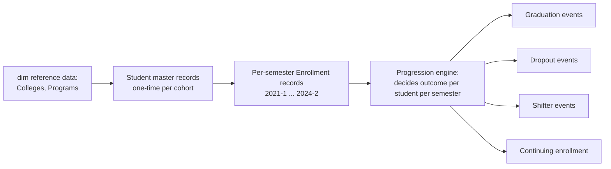

# 08 — Faker Data Generator

## 1. Design Goal

The generator's job is not "produce random rows" — it's to produce a dataset that **behaves like a real university's data would behave**, including the messiness (typos, late corrections, edge cases) that a real Silver layer needs to handle. A too-clean synthetic dataset would make the Silver validation/quality layer pointless to build, since there'd be nothing for it to catch.

## 2. Folder Structure

> **Naming note:** this package is called `data_generator/`, not `faker/`, even though it's built around the `faker` PyPI library. A folder literally named `faker/` at the repo root silently shadows the installed `faker` package the moment it becomes a real Python package (i.e., gains an `__init__.py`) — because the repo root sits ahead of site-packages on `sys.path` (see `pytest.ini`'s `pythonpath = .`, added Day 3). This was caught and fixed on Day 4 before any generator code was written against the colliding name.

> **Reference-data note:** colleges and programs are **not** duplicated here. `data_generator` reads `configs/colleges.yaml` and `configs/programs.yaml` (Day 3) via `pipelines/common/config.py` — repeating that mapping in a second file would violate the single-source-of-truth principle those configs exist to enforce.

```
data_generator/
├── config/
│   ├── volumes.yaml                # cohort sizes, college/gender/admission-type weights, risk-profile params
│   └── noise_rules.yaml             # typo rate, duplicate rate, late-correction rate (Day 6)
├── generators/
│   ├── generate_students.py
│   ├── generate_enrollment.py
│   ├── generate_progression.py     # drives dropout/graduation/shifter logic
│   └── generate_all.py             # orchestrates generation order
├── rules/
│   ├── progression_rules.py        # probability model for student outcomes
│   └── noise_injection.py          # typos, duplicates, nulls
└── output/
    ├── student_master.csv           # cohort-level, generated once (Day 4) — not semester-scoped
    ├── _internal/                    # generator-only state, NEVER treated as source data downstream
    │   └── student_latent_profiles.csv   # per-student risk_score; a real SIS has no such column
    └── {academic_year}/{semester}/*.csv  # enrollment/graduation/dropout/shifter, from Day 5 onward
```

## 3. Generation Order (Entity Dependency Graph)



Reference data (colleges, programs) is generated first and is static across the whole run — it's the "dimension seed" the rest of the generator depends on. Students are generated as **cohorts** (one entry cohort per academic year, e.g., "AY2021 Freshman Cohort"), and then a **progression engine** runs semester-by-semester over each cohort deciding what happens to each student — this cohort-based approach is what makes retention/graduation-rate analysis meaningful later, since real institutional KPIs are inherently cohort-based ("what % of the 2021 entering cohort graduated by 2024?").

## 4. Business Rules Driving Realism

### Student Progression Logic
Each student has a **latent "risk profile"** (drawn once at cohort entry, hidden from the data itself) that skews their semester-by-semester outcome probabilities — this simulates the real-world fact that some students are inherently higher-risk (financial, academic, personal factors) without the generator needing to fabricate those underlying reasons. This latent variable is what makes retention correlate sensibly across semesters instead of being pure independent-per-semester noise.

### Dropout Logic
- Base per-semester dropout probability, higher in year 1 (consistent with real attrition curves — first-year attrition is typically the highest).
- Probability increases if `year_level` progression has stalled (re-enrolled in the same year level twice) — simulating academic difficulty.
- Once dropped, a student generates no further semester enrollment records (terminal state).

### Graduation Logic
- Programs have a `nominal_duration` (from `colleges_programs.yaml`, e.g., 4 years for most Bachelor's, 2 years for Certificates).
- A student "eligible" to graduate (reached nominal duration, no dropout) graduates with a probability that increases each semester past nominal duration, capturing that some students take longer than the standard timeline (also realistic).
- Graduation is a terminal state — no further enrollment records after.

### Shifter Logic
- A student in year 1 or 2 has a small per-semester probability of shifting programs (shifting after year 2 is rare and modeled as such — reflecting real curriculum lock-in).
- On shift, a `fact_shifter`-source record is generated (`from_program`, `to_program`, `shift_semester`), and the student's subsequent enrollment records use the new program going forward.

### Retention Logic
Derived, not directly generated — retention is computed downstream (Gold layer) as "enrolled in consecutive semesters within the same cohort," so the Faker generator only needs to produce consistent semester-by-semester enrollment/outcome records; it doesn't need its own retention-specific logic.

### Semester & Academic Year Progression
The generator iterates `for academic_year in [2021, 2022, 2023, 2024]: for semester in [1, 2]:`, applying the progression engine per cohort per semester-step, so cohort tenure (a student's 3rd semester, say) is tracked explicitly and used by the graduation/dropout probability functions above.

## 5. Randomization & Business Rule Summary Table

| Event | Driven by | Realism mechanism |
|---|---|---|
| Enrollment continuation | Latent risk profile + year-level stall count | Correlated risk across semesters, not independent coin flips |
| Dropout | Base rate × year-level modifier × risk profile | Higher attrition in year 1, matches real institutional patterns |
| Graduation | Nominal program duration + probability ramp after nominal duration | Some students finish late, matches real completion timelines |
| Shifter | Year level (only years 1–2) × small base rate | Reflects real curriculum lock-in after year 2 |
| Data noise | `noise_rules.yaml`: typo rate ~2%, duplicate submission rate ~1%, late correction rate ~3% | Gives Silver layer's validation/dedup logic something real to do |

## 6. Constraints & Foreign Keys

- Every generated `program_id` must exist in `colleges_programs.yaml` — enforced by generating enrollment records only by sampling from the program list, never free-text.
- Every `student_id` referenced in enrollment/graduation/dropout/shifter files must exist in the student master file generated first — enforced structurally by generation order, and re-validated by Silver's schema checks (defense in depth: even though the generator *shouldn't* produce orphans, the pipeline validates as if it might, matching how a real pipeline must never blindly trust its source).

## 7. Data Volume (Suggested)

| Entity | Volume | Rationale |
|---|---|---|
| Colleges | 8 | Fixed per NEUST Sumacab structure |
| Programs | 37 | Fixed per structure given (see `configs/programs.yaml`, Day 3) |
| Students (total across all cohorts, 2021–2024) | ~6,000–8,000 | Large enough for statistically meaningful retention/success-rate trends per program, small enough to keep local Postgres/DuckDB processing trivially fast |
| Enrollment records | ~35,000–45,000 | ~6-8 semesters average tenure × student count |
| Graduation events | ~1,500–2,500 | Consistent with realistic 4-year completion rates |
| Dropout events | ~800–1,500 | Consistent with realistic attrition rates |
| Shifter events | ~400–700 | Small % of students, concentrated in years 1–2 |

## 8. Validation Rules on Generated Output

Before the generated data is treated as a valid "source system extract" (i.e., before ingestion picks it up), the generator runs a self-check:
- Every student has exactly one terminal outcome or is still active as of 2024-2 (no student both graduates and drops out).
- No enrollment record references a nonexistent program/college.
- Per-cohort dropout + graduation + still-active counts sum to the cohort's total size.

This self-check step matters pedagogically: it's the same discipline as validating any other "source system" — even though you control the generator, you don't get to skip validating its output, because the whole point of the project is to practice treating upstream data as untrusted until proven otherwise.

## 9. Implementation Notes — Student Master Generator (Day 4)

**Module:** `data_generator/generators/generate_students.py`, run via `python -m data_generator.generators.generate_students` from the repo root.

**Actual generated volume:** 7,800 students — 1,800 / 1,900 / 2,000 / 2,100 across the 2021–2024 cohorts respectively, using a slight year-over-year growth curve (config: `data_generator/config/volumes.yaml`) so the enrollment trend has something real to show downstream instead of a flat, suspiciously uniform series.

**Observed distributions against configured targets** (validated post-generation, not just assumed from the config):

| Attribute | Configured target | Observed |
|---|---|---|
| Gender | 48% M / 52% F | 47.7% M / 52.3% F |
| Admission type | 85% Freshman / 15% Transferee | 85.2% / 14.8% |
| Age at entry | mode 18, decaying tail to 25 | min 18, max 25, mean 19.0 |
| College shares | per `college_weights` | within ~0.5pp of every configured weight |

**Two-stage validation, reusing Day 3's pattern.** `load_volumes_config` checks shape (every weight mapping sums to ~1.0); a separate `validate_college_weights_match_reference` call checks it against the *actual* reference data loaded via Day 3's `pipelines.common.config` loader — catching both a typo'd weight total and a weight key that doesn't match a real `college_id`, as two distinct, specifically-worded errors. This is the same shape-vs-relationship split used for `configs/colleges.yaml`/`configs/programs.yaml`, applied again here rather than invented fresh — a config validation pattern, reused.

**The latent risk score never touches the public file.** `student_master.csv` (9 columns, everything a real registrar export would plausibly contain) and `output/_internal/student_latent_profiles.csv` (`student_id`, `risk_score` only) are written separately. Any pipeline code downstream that reads `student_master.csv` as if it were real source data — which Bronze ingestion (Day 8) will do — has no way to see `risk_score`, exactly as a real SIS extract wouldn't. The Day 5 progression engine is the only consumer of the internal file.

**Testing:** `tests/unit/test_generate_students.py` — 21 tests. Distributional tests (gender, age-offset, risk-score skew, transferee year-level split) draw 20,000 samples per check with a fixed seed and assert the observed share lands within 2 percentage points of the configured weight — tight enough to catch a real bug (e.g., an inverted weight, a broken normalization step) without being flaky from run to run, since the seed is fixed.

## 10. Implementation Notes — Progression Engine (Day 5)

**Modules:** `data_generator/rules/progression_rules.py` (pure probability functions) + `data_generator/generators/generate_progression.py` (per-student state machine + full-population orchestration), run via `python -m data_generator.generators.generate_progression`.

**Mechanics.** Each student is simulated semester-by-semester from their entry index through 2024-2 (or a terminal outcome), in this order each semester: (1) dropout check, (2) graduation check (only once tenure ≥ nominal duration), (3) shifter check (years 1–2 only, at most once per student), (4) emit that semester's enrollment record, (5) year-level advance-or-stall check at year boundaries. Dropout probability rises with year-1 status, latent `risk_score`, and prior stall count; graduation probability ramps up the longer a student has been eligible without graduating; shifting is only modeled in years 1–2, matching real curriculum lock-in.

**Actual output** (7,800 students, seed 43): 32,701 enrollment records, 965 graduation events, 1,255 dropout events, 352 shifter events. Per-cohort reconciliation (`cohort_totals_reconciled`) passes — every student lands in exactly one of ACTIVE/GRADUATED/DROPPED, satisfying Day 5's validation checklist directly rather than by manual inspection.

### ⚠️ Known limitation, found during implementation (not in the original design)

The generator only simulates students **entering** during the observed 2021–2024 window — there is no population of students who enrolled *before* 2021 and are already mid-program as of 2021-1. A real university's 2021-1 semester would include continuing 2nd/3rd/4th/5th-year students; this synthetic one contains only brand-new entrants. Consequences, confirmed against the actual generated data:

- **Graduation totals came in below the ~1,500–2,500 estimate in Section 7**: 965 actual events. That estimate assumed an ongoing institution with students already at every year level in 2021-1; this generator has no such backstory.
- **Graduation events skew heavily toward short programs**: 548 Certificate + 71 Diploma vs. only 346 Bachelor's, out of 965 total — because a 4-year (8-semester) program can only produce a graduate from the 2021 cohort, and only in their exact 8th semester (2024-2), which is a single eligibility window rather than several.
- **5-year programs (Architecture, Engineering) cannot produce a single natural graduate within this window** — even the 2021 cohort only accumulates 8 semesters of tenure by 2024-2, short of the 10 a 5-year program needs. This is asserted directly as a test (`test_five_year_program_cannot_graduate_within_observed_window`) specifically so that if the mechanics ever change to allow it, the test fails and forces this doc to be revisited.

**Why this wasn't silently patched by tweaking the probability model:** inflating graduation probabilities to hit the original target number would have hidden the actual structural cause (a truncated observation window) behind numbers that merely *looked* plausible — worse than an honestly-labeled gap, because it would pass a casual review while still being wrong underneath.

**Proposed fix (deferred, not built):** simulate "legacy" entry cohorts starting a few years before 2021 (e.g., 2018–2020), running the same `simulate_student` engine for their pre-2021 history *without emitting any Bronze-visible records* for semesters before 2021-1, then continuing to simulate and emit normally from 2021-1 onward — exactly as if those students' history only becomes observable when the registrar extract window begins. This is a real, common data engineering pattern (initializing state for a left-censored/truncated observation window) and is tracked in `docs/14_Future_Improvements.md` rather than built now, to avoid expanding Day 5's scope mid-roadmap.

**Testing:** `tests/unit/test_progression_rules.py` (17 tests on the pure probability functions — monotonicity in year level/risk/stall count, capping behavior, weighted-draw shape) and `tests/unit/test_generate_progression.py` (18 tests — semester-index arithmetic, single-student scenarios including the documented 5-year-program limitation as an explicit regression test, and full-population reconciliation against a small fixture population).

## 11. Implementation Notes — Noise Injection (Day 6)

**Modules:** `data_generator/rules/noise_injection.py` (pure functions) + `data_generator/generators/apply_noise.py` (file-level orchestration), run via `python -m data_generator.generators.apply_noise` — **after** Day 4's student generation and Day 5's progression simulation, never interleaved with them. Noise is a distinct final stage precisely so dropout/graduation probability tests (Day 5) never have to account for noisy input, and noise-rate tests (Day 6) never have to account for business-logic randomness.

**Scope discipline:** noise never touches fields carrying referential integrity — `student_id`, `program_id`, `college_id`, `academic_year`, `semester_number` are never mutated. Only descriptive text (`enrollment_status` casing, `home_province` typos) and record-level arrival behavior (duplicates, late corrections) are noised. Confirmed directly: 33,800 enrollment rows checked post-injection, **zero** FK violations against `student_master.csv`/`configs/programs.yaml`/`configs/colleges.yaml`.

**Actual observed rates vs. configured targets** (7,800 students, real dataset):

| Noise type | Configured target | Observed |
|---|---|---|
| Typos (`home_province`) | 2% | 1.96% (153 / 7,800) |
| In-partition duplicates | 1% | 0.91% (298 / 32,701 eligible rows) |
| Late corrections | 3% | 2.99% (801 / 26,787 *eligible* rows — correctly excludes 2024-2, since there's no later partition for a "late" correction to land in) |
| Status-casing noise | ~45% of ENROLLED rows (per configured variant weights) | 43.2% of all 32,701 rows noised — consistent, since the large majority of rows are ENROLLED |

**The late-correction rate is measured against the correct denominator, not total row count** — rows already in the last partition (2024-2) have no later partition to be "corrected into," so they're structurally ineligible. Measuring against all rows would have shown ~2.45% and looked like a bug; measuring against eligible rows shows 2.99%, matching the target. This distinction mattered enough to get it wrong on the first pass during validation — worth remembering as a general lesson: before comparing an observed rate to a target, check whether every row in your denominator was actually eligible to be selected.

**Resulting text messiness Silver will need to normalize** (Week 2): 9 distinct `enrollment_status` text variants across the dataset — `ENROLLED`, `Enrolled`, `enrolled`, `' ENROLLED '`, `GRADUATED`, `Graduated`, `DROPPED`, `Dropped`, `DROPPED OUT` — exactly the kind of controlled-vocabulary mapping problem `05_Medallion_Architecture.md`'s Silver section describes, now backed by real messy data rather than a hypothetical.

**Testing:** `tests/unit/test_apply_noise.py` — 16 tests, including statistical rate checks (20,000-draw seeded samples for status-casing, typo, duplicate, and late-correction rates) and explicit FK-integrity assertions on both the student-master typo path and the enrollment-partition duplicate/late-correction path.

---
*Next: `09_Data_Science.md` — the Success Rate model.*
