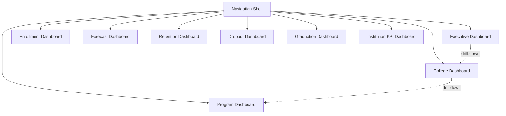

# 11 — Dashboard Design

## 1. Design Principle

**Dashboards read Gold/marts only, and contain zero business logic.** Every number shown was already computed, tested, and validated upstream (`fact_institution_kpi`, `mart_*` models). This is what guarantees the dashboard never disagrees with a direct SQL query against the warehouse.

## 2. Dashboard Suite Overview

### 2.1 Executive Dashboard
**Audience:** university leadership. **Purpose:** one-screen institutional health check.
- KPI cards: overall Success Rate (current semester + trend arrow), total enrollment, total graduates, dropout rate.
- Line chart: Success Rate over time (2021-1 → 2024-2), campus-wide.
- Bar chart: Success Rate by college, current semester (drill-down entry point).
- Filters: academic year, semester.

### 2.2 College Dashboard
- KPI cards scoped to selected college: enrollment, retention rate, graduation rate, dropout rate, success rate.
- Bar chart: success rate by program within the college (drill-down to Program Dashboard).
- Trend line: college success rate over time vs. campus-wide average (benchmarking).
- Filters: college selector, year range.

### 2.3 Program Dashboard
- Enrollment by year level (stacked bar) — shows where in the pipeline students are concentrated.
- Retention funnel: cohort size → year 2 → year 3 → year 4 → graduates (funnel chart).
- Dropout/shifter counts, by semester.
- Filters: program selector, cohort year.

### 2.4 Enrollment Dashboard
- Total enrollment trend, campus-wide and by college.
- New enrollee vs. continuing student split (stacked area chart).
- Table: enrollment by program, current vs. prior semester, with % change.

### 2.5 Forecast Dashboard
- Line chart: historical actuals + Prophet forecast with confidence band, selectable metric (enrollment/graduates/population) and entity (college/program).
- Table: forecast accuracy of prior forecasts vs. actuals (MAE/MAPE per past forecast).
- Filters: entity, metric, forecast horizon (1 or 2 semesters ahead).

### 2.6 Retention Dashboard
- Retention rate trend by college/program.
- Cohort retention curves (% of entering cohort still enrolled at each subsequent semester) — the classic "cohort survival curve" view.

### 2.7 Dropout Dashboard
- Dropout rate trend by college/program.
- Dropout concentration by year level (where in the student journey attrition happens most).

### 2.8 Graduation Dashboard
- Graduation counts and rate trend by college/program.
- Average years-to-completion distribution.

### 2.9 Institution KPI Dashboard
- All six Success Rate sub-components shown side-by-side (not just the composite) — directly supporting the transparency principle from `09_Data_Science.md`.
- Composite Success Rate trend with a component breakdown on hover/click.

## 3. Navigation & Drill-Down Pattern

Executive → College → Program is the primary drill-down chain, implemented via Superset's native filter-linking (clicking a college bar on the Executive dashboard sets a College filter and links to the College dashboard). This mirrors how administrators actually think about the org hierarchy — top-line number first, then "which college is driving this," then "which program within that college."

## 4. Suggested Chart Types Summary

| Question type | Chart |
|---|---|
| "How is X trending over time?" | Line chart |
| "How does X compare across colleges/programs?" | Bar chart |
| "What's the composition of X?" | Stacked bar / area |
| "How does a cohort shrink over time?" | Funnel chart |
| "What's the KPI right now?" | Big number / KPI card with trend arrow |
| "How confident is the forecast?" | Line chart + shaded confidence interval band |

## 5. Why Superset + a Small Streamlit App, Not One Tool for Everything

Superset handles the 8 "standard BI" dashboards well — they're fundamentally filter/drill-down over pre-aggregated marts, exactly Superset's strength. The Forecast Dashboard's "select entity, select metric, see forecast + accuracy history" interaction is more naturally built as a small custom Streamlit app directly querying `fact_forecast` and `mart_forecast_accuracy` — giving full control over the confidence-band visualization and forecast-vs-actual comparison view without fighting a BI tool's chart builder for a fairly specific interactive layout. Both read only from `gold`/`marts` schemas — the split is a presentation-tooling choice, not a data-architecture one.

---
*Next: `12_Implementation_Roadmap.md` — the day-by-day 30-day build plan.*
